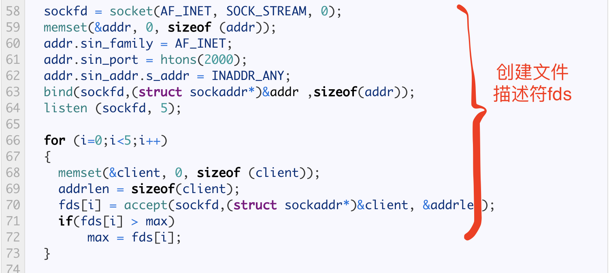
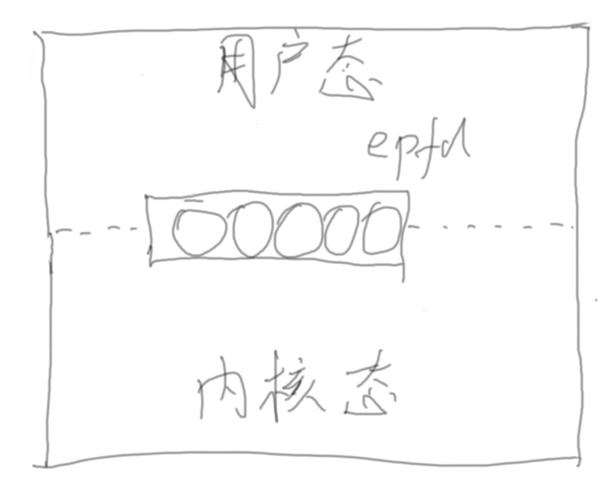
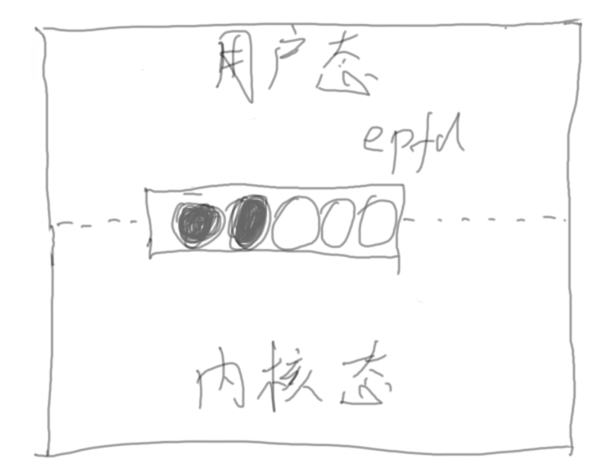
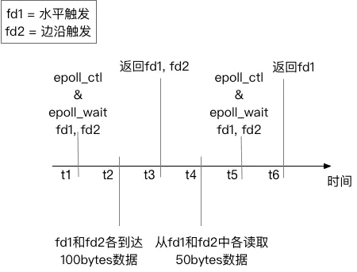

## I/O 多路复用

高性能Web服务器的，需要供多个客户端连接并且处理客户端传递上来的请求，此时如果采用多线程处理方式，每个请求一个线程，但是这种方式存在一个很大的弊端，需要cpu上下文切换，cpu上下文切换要处理一些操作句柄，当客户端非常多当时候，上下文切换带来当资源消耗会非常的高。

所以多线程并不能很好的解决，下面来看看其他的解决方案 IO多路复用：select,poll,epoll

### 介绍

当TCP客户机同时处理两个输入：标准输入和TCP socket时，当客户机在对fgets的调用中被阻塞（在标准输入上）并且服务器进程被终止时，我们遇到了一个问题。服务器TCP正确地向客户机TCP发送了一个FIN，但是由于客户机进程从标准输入中读取被阻止，所以直到它从套接字中读取（可能要晚很多时间）它才看到EOF。

如果一个或多个I/O条件就绪（即，输入准备好读取，或者描述符能够获取更多输出），我们希望得到通知。这种功能称为I/O多路复用，由select和poll函数以及较新的POSIX变体pselect提供。

I/O多路复用通常用于以下场景中的网络应用：

* 当客户端处理多个描述符时（通常是交互式输入和网络套接字）
* 当一个客户端同时处理多个套接字时（这是可能的，但很少）
* 如果TCP服务器同时处理侦听套接字及其连接的套接字
* 如果服务器同时处理TCP和UDP
* 如果一个服务器处理多个服务和多个协议
* I/O多路复用不限于网络编程。许多非平凡的应用程序都需要这些技术。

### select

#### 源码分析

select() 系统调用提供了一种实现同步多路复用I/O的机制。
```c
int select(int nfds, fd_set *readfds, fd_set *writefds, fd_set *exceptfds, struct timeval *timeout);
```

对select() 的调用将被阻塞，直到给定的文件描述符准备好执行I/O，或者直到经过可选的指定超时

监视的文件描述符分为三组
* readfds集合中列出的文件描述符将被监视，以查看数据是否可用于读取。
* writefds集中列出的文件描述符将被监视，以查看写入操作是否会在没有阻塞的情况下完成。
* 将监视exceptfds集中的文件描述符，以查看是否发生了异常，或者带外数据是否可用（这些状态仅适用于套接字）。

给定的集合可能为NULL，在这种情况下select()不监视该事件。

成功返回时，将修改每个集合，使其仅包含准备好进行该集合所描述类型的I/O的文件描述符

代码分析：
```c++
#include <stdio.h>
#include <sys/types.h>
#include <sys/socket.h>
#include <netinet/in.h>
#include <wait.h>
#include <signal.h>
#include <errno.h>
#include <sys/select.h>
#include <sys/time.h>
#include <unistd.h>
 
#define MAXBUF 256
 
void child_process(void)
{
  sleep(2);
  char msg[MAXBUF];
  struct sockaddr_in addr = {0};
  int n, sockfd,num=1;
  srandom(getpid());
  /* Create socket and connect to server */
  sockfd = socket(AF_INET, SOCK_STREAM, 0);
  addr.sin_family = AF_INET;
  addr.sin_port = htons(2000);
  addr.sin_addr.s_addr = inet_addr("127.0.0.1");
 
  connect(sockfd, (struct sockaddr*)&addr, sizeof(addr));
 
  printf("child {%d} connected \n", getpid());
  while(1){
        int sl = (random() % 10 ) +  1;
        num++;
     	sleep(sl);
  	sprintf (msg, "Test message %d from client %d", num, getpid());
  	n = write(sockfd, msg, strlen(msg));	/* Send message */
  }
 
}
 
int main()
{
  char buffer[MAXBUF];
  int fds[5];
  struct sockaddr_in addr;
  struct sockaddr_in client;
  int addrlen, n,i,max=0;;
  int sockfd, commfd;
  fd_set rset;
  for(i=0;i<5;i++)
  {
  	if(fork() == 0)
  	{
  		child_process();
  		exit(0);
  	}
  }
 
  sockfd = socket(AF_INET, SOCK_STREAM, 0);
  memset(&addr, 0, sizeof (addr));
  addr.sin_family = AF_INET;
  addr.sin_port = htons(2000);
  addr.sin_addr.s_addr = INADDR_ANY;
  bind(sockfd,(struct sockaddr*)&addr ,sizeof(addr));
  listen (sockfd, 5); 
 
  for (i=0;i<5;i++) 
  {
    memset(&client, 0, sizeof (client));
    addrlen = sizeof(client);
    fds[i] = accept(sockfd,(struct sockaddr*)&client, &addrlen);
    if(fds[i] > max)
    	max = fds[i];
  }
  
  while(1){
	FD_ZERO(&rset);
  	for (i = 0; i< 5; i++ ) {
  		FD_SET(fds[i],&rset);
  	}
 
   	puts("round again");
	select(max+1, &rset, NULL, NULL, NULL);
 
	for(i=0;i<5;i++) {
		if (FD_ISSET(fds[i], &rset)){
			memset(buffer,0,MAXBUF);
			read(fds[i], buffer, MAXBUF);
			puts(buffer);
		}
	}	
  }
  return 0;
}
```

如图：



此处创建了一批文件描述符fds，代码70行可以看出，创建了5个文件描述符，可以接收5个客户端的连接。fds的每个元素是一个数，就是文件描述符的一个编号，这个编号不是按顺序的，是随机的，并且会得出一个最大的文件描述符标号值，存到max里。

返回时，select将集合更改为只包含准备好的文件描述符，因此我们需要在每次迭代中再次构建集合。

需要告诉select什么是编号最高的文件描述符的原因是fd_set的内部实现。每个fd由一个位声明，因此fd_set是32个整数的数组（32*32bit=1024位）也就是bitmap。该函数检查任何位，看看它是否设置，直到它达到最大值。这意味着，如果我们有5个文件描述符，但最大值是900，函数将检查0到900之间的任何位，以找到要监视的文件描述符。有一个posix替代选择–pselect，它在等待时添加一个信号掩码。

另外
```c++
select(max+1, &rset, NULL, NULL, NULL);
```

此处的select 会将rset就是fd_set bitmap 需要全量的从用户空间拷贝到内核空间，有以下两种情况：
* 是否有数据到来，如果没有，则阻塞
* 如果有数据到来
    1. 将有数据的fd_set置位
    2. select函数返回，不再阻塞
    3. 程序接着执行，在循环里面判断哪一位的rset被置位
    4. 读出被置位的那一位数据并且进行相应的处理

#### 缺点

* fd_set 有大小限制，默认1024
* fd_set 不可重用，每次都需要创建一个新的fd_set的bitmap
* fd_set从用户态到内核态仍然需要有很大的开销
* select 返回时仍然需要O(n)的时间复杂度遍历fd集合，将有数据的fd读出。

### poll

与 select() 的三个基于位掩码的文件描述符集效率低下不同，poll() 使用单个 nfds pollfd 结构数组。 原型更简单：
```c
int poll (struct pollfd *fds, unsigned int nfds, int timeout);
```
结构pollfd有不同的事件和返回事件字段，因此我们不需要每次都构建它：
```c
struct pollfd {
      int fd;
      short events; 
      short revents;
};
```
* fd 文件描述符
* events 关注的事件是什么，读：POLLIN，写：POLLOUT,读和写 就是 POLLIN & POLLOUT
* revents 对events的回馈


对于每个文件描述符，构建一个pollfd类型的对象并填充所需的事件。轮询返回后，检查“revents”字段


#### 源码分析

```c++
for (i=0;i<5;i++) 
{
    memset(&client, 0, sizeof (client));
    addrlen = sizeof(client);
    // 每个元素声明为socket的一个文件描述符 并将其赋值给 pollfds元素的fd
    pollfds[i].fd = accept(sockfd,(struct sockaddr*)&client, &addrlen);
    // 只关注读事件 所以赋值为 POLLIN
    pollfds[i].events = POLLIN;
}
sleep(1);
while(1){
  	puts("round again");
	poll(pollfds, 5, 50000);
 
	for(i=0;i<5;i++) {
		if (pollfds[i].revents & POLLIN){
			pollfds[i].revents = 0;
			memset(buffer,0,MAXBUF);
			read(pollfds[i].fd, buffer, MAXBUF);
			puts(buffer);
		}
	}
}
```

```c++
poll(pollfds, 5, 50000);
```

poll 方法会将 pollfd的数组pollfds传入并阻塞。

* 当有数据时：
    1. 内核会将 pollfd 的revents置位，置位 POLLIN
    2. poll 方法返回，数据处理 判断 revents是否被置位，如果被置位为POLLIN，说明有数据
    3. 先将 revents置位还原(pollfds[i].revents = 0;)，以达到重用pollfds
    4. 然后调用 read和puts读数据和处理数据

#### poll解决了select的哪些缺点？
* fd_set大小限制问题，这里使用pollfds数组，数组没有大小下限制
* 利用结构体 pollfd，每次重置 revents,而不需要每次重新创建，解决了重用问题。

#### 仍存在的缺点

* pollfds从用户态到内核态仍然需要有很大的开销
* select 返回时仍然需要O(n)的时间复杂度遍历pollfds数组，将有数据的fd读出。

#### poll与select
* poll() 不要求用户计算最高编号的文件描述符的值+1
* poll() 对于大值文件描述符更有效。 select() 观察一个值为 900 的文件描述符——内核必须检查每个传入集合的每一位，直到第 900 位。
* select() 的文件描述符集是静态大小的。
* 使用 select()，文件描述符集在返回时被重建，因此每个后续调用都必须重新初始化它们。 poll() 系统调用将输入（events 字段）与输出（revents 字段）分开，允许数组无需更改即可重用。
* select( ) 的超时参数在返回时未定义。 便携式代码需要重新初始化它。 这不是 pselect() 的问题
* select() 更便携，因为一些 Unix 系统不支持 poll()

### epoll

**一下情况为水平触发情况**

在使用select和poll时，我们管理用户空间中的所有内容，并将每次调用的集合发送给wait。要添加另一个套接字，我们需要将其添加到集合中，然后再次调用select/poll。

Epoll*系统调用帮助我们在内核中创建和管理上下文。我们将任务分为3个步骤：

* 使用epoll_create在内核中创建上下文
* 使用epoll_ctl在上下文中添加或删除文件描述符
* 使用epoll_wait在上下文中等待事件

```c++
struct epoll_event events[5];

  int epfd = epoll_create(10);
  ...
  ...
  for (i=0;i<5;i++) 
  {
    static struct epoll_event ev;
    memset(&client, 0, sizeof (client));
    addrlen = sizeof(client);
    ev.data.fd = accept(sockfd,(struct sockaddr*)&client, &addrlen);
    ev.events = EPOLLIN;
    epoll_ctl(epfd, EPOLL_CTL_ADD, ev.data.fd, &ev); 
  }
  
  while(1){
  	puts("round again");
  	nfds = epoll_wait(epfd, events, 5, 10000);
	
	for(i=0;i<nfds;i++) {
			memset(buffer,0,MAXBUF);
			read(events[i].data.fd, buffer, MAXBUF);
			puts(buffer);
	}
  }
```

1. epoll_create(10) 这里调用 epoll_create在内核中创建上下文
2. epoll_ctl(epfd, EPOLL_CTL_ADD, ev.data.fd, &ev); 调用 epoll_ctl 向上下文中添加 fd和events事件。events结构体为epoll_event类型，与pollfd很像 有fd字段和events字段，但没有revents字段。
3. 调用epoll_wait时，用户态和内核态共享epfd内存，内核去判断哪个fd有数据到来，如下图所示



当有数据时：
1. 通过重排达到重置效果，如下图所示，将有数据的fd排序到前面
2. 返回，将触发了 fd事件的数量返回，nfds为多少个fd触发了相应事件数量
3. 遍历前nfds个元素进行数据的读取和处理即可，操作时间复杂度达到了O(1),因为epoll_wait时,已经events重排，前面nfds个fd即为触发的时间的描述符



#### epoll 解决的问题

1. 解决了描述符从用户态到内核态拷贝的开销
2. 遍历的复杂度达到了O(1)

#### epoll 与select /poll
* 可以在等待时添加和删除文件描述符
* epoll_wait 只返回文件描述符就绪的对象
* epoll 有更好的性能——O(1) 而不是 O(n)
* epoll 可以表现为级别触发或边缘触发
* epoll 是 Linux 特定的，因此不可移植

#### epoll IO事件触发模式

epoll除了提供select/poll那种IO事件的水平触发（Level Triggered）外，还提供了边缘触发（Edge Triggered），这就使得用户空间程序有可能缓存IO状态，减少epoll_wait/epoll_pwait的调用，提高应用程序效率。

* 水平触发（LT）：默认工作模式，即当epoll_wait检测到某描述符事件就绪并通知应用程序时，应用程序可以不立即处理该事件；下次调用epoll_wait时，会再次通知此事件
*边缘触发（ET）： 当epoll_wait检测到某描述符事件就绪并通知应用程序时，应用程序必须立即处理该事件。如果不处理，下次调用epoll_wait时，不会再次通知此事件。（直到你做了某些操作导致该描述符变成未就绪状态了，也就是说边缘触发只在状态由未就绪变为就绪时只通知一次）。

#### epoll 水平触发和边缘触发分析

考虑下图中的例子。有两个socket的fd——fd1和fd2。我们设定监听f1的“水平触发读事件“，监听fd2的”边沿触发读事件“。我们使用在时刻t1，使用epoll_wait监听他们的事件。在时刻t2时，两个fd都到了100bytes数据，于是在时刻t3, epoll_wait返回了两个fd进行处理。在t4，我们故意不读取所有的数据出来，只各自读50bytes。然后在t5重新注册两个事件并监听。在t6时，只有fd1会返回，因为fd1里的数据没有读完，仍然处于“被触发”状态；而fd2不会被返回，因为没有新数据到达。

如图：


这个例子很明确的显示了水平触发和边沿触发的区别。

* 水平触发只关心文件描述符中是否还有没完成处理的数据，如果有，不管怎样epoll_wait，总是会被返回。简单说——水平触发代表了一种“状态”。
* 边沿触发只关心文件描述符是否有新的事件产生，如果有，则返回；如果返回过一次，不管程序是否处理了，只要没有新的事件产生，epoll_wait不会再认为这个fd被“触发”了。简单说——边沿触发代表了一个“事件”。

### 总结

总结一下select,poll,epoll的区别：

|          |      select   |  poll | epoll |
|----------|:-------------:|:------:|:------:|
| 操作方式 |  遍历 | 遍历 | 回调 |
| 底层实现 |    数组   |   链表 | 红黑树 |
| IO效率 | 每次调用都进行线性遍历，时间复杂度为O(n) |    每次调用都进行线性遍历，时间复杂度为O(n) | 事件通知方式，每当fd就绪，系统注册的回调函数就会被调用，将就绪fd放到readyList里面，时间复杂度O(1) |
| 最大连接数 |    1024（x86）或2048（x64）   |   无上限 | 无上限 |
| fd拷贝 |    每次调用select，都需要把fd集合从用户态拷贝到内核态   |   每次调用poll，都需要把fd集合从用户态拷贝到内核态 | 调用epoll_ctl时拷贝进内核并保存，之后每次epoll_wait不拷贝 |

### 参考

* https://devarea.com/linux-io-multiplexing-select-vs-poll-vs-epoll/#.YNhWFRMzY-T
* https://notes.shichao.io/unp/ch6/
* https://www.jianshu.com/p/397449cadc9a
* https://www.jianshu.com/p/9011dad4d96d
* https://www.bilibili.com/video/BV1qJ411w7du?from=search&seid=7408350256900785032


