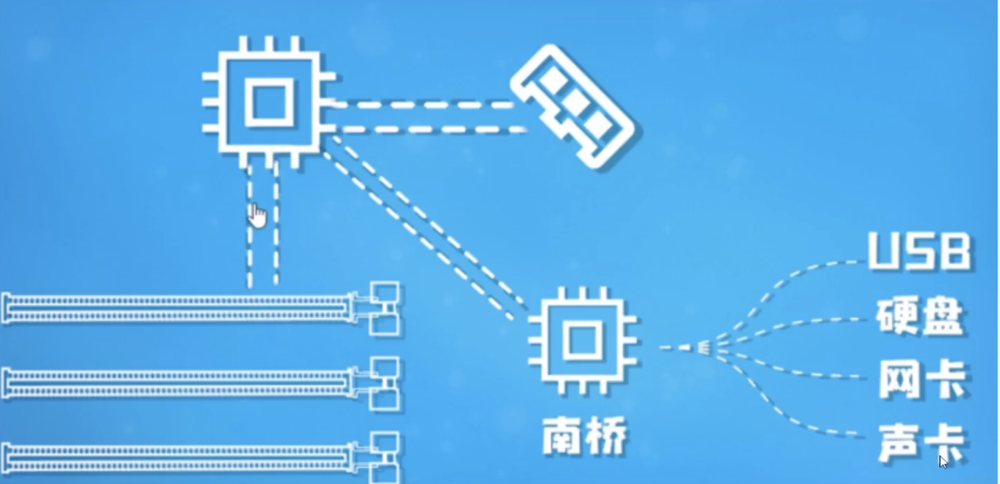

## 内存

计算机重要组成：cpu,内存，南桥（包含DMA 直接内存访问），pcie，外部设备（USB、磁盘、网卡、声卡）

### DMA的应用

当cpu 忙碌时，由需要从数据将磁盘加载到内存到处理时，cpu把控制总线权交给DMA，DMA会把将数据从磁盘加载到内存，在加载过程中，DMA并不一直持有总线的控制权，而是间接持有，间接的交还给cpu，让cpu做其他事情。

### 操作系统内存管理

#### 为什么要有逻辑地址（虚拟地址）？

为了让少量的物理CPU，提供几乎有无数个CPU可用的假象。

操作系统通过虚拟化（virtualizing）cpu来提供这种假象。通过一个进程只运行一个时间片，然后切换到其他进程，操作系统提供了存在很多个虚拟cpu的假象。这就是时分（time sharing）cpu技术，允许用户如愿运行多个并发进程。潜在的开销就是性能损失，因为如果cpu必须共享，每个进程的运行就会慢一点。

#### 逻辑地址与物理地址如何映射？

程序逻辑内存分为多个页（page）

将物理内存分为多个帧（page frame）

通过页表（page table）将逻辑地址和物理地址进行映射关联。

* 内存的一个地址存的是一个字节的数据
* 32位OS物理地址有2^32个，因而只能使用4GB内存。

