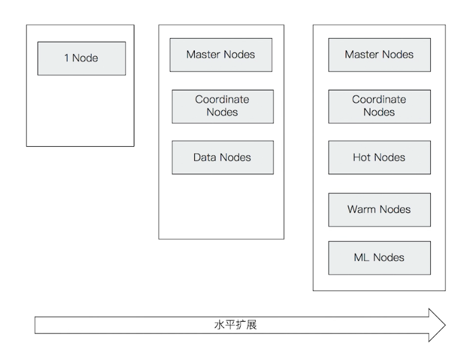

## elasticsearch 的简介

### elasticsearch 的诞生
* 2004 年 Shay Banon 基于 Lucence 开发了 Compass
* 2010  年 Shay Banon重写了Compass，取名 Elasticsearch
    * 支持分布式，可水平扩展
    * 降低全文检索的学习曲线，可以被任何编程语言调用

### elasticsearch 的分布式架构

1. 集群规模可以从单个扩展至数百万个节点
2. 高可用 & 水平扩展
    * 服务和数据两个纬度
3. 支持不同的节点类型
    * 支持 Hot & Warm 架构

### 支持多种方式接入
* 多种编程语言的类库（https://www.elastic.co/guide/en/elasticsearch/client/index.html）
    * Java / .NET / Python / PHP / Groovy / Perl
* RESTful API v.s Transport API
    * 9200 v.s 9300 (建议你使用RESTful API)
* JDBC & ODBC

### 主要功能
* 海量数据的分布式存储及集群管理
    * 服务与数据的高可用，水平扩展
* 近实时搜索，性能卓越
    * 结构化 / 全文 / 地理位置 / 自动完成
* 海量数据的近实时分析
    * 聚合功能