> 原教程地址:https://www.bilibili.com/video/BV19r4y1w7Nx?p=2 \

> 作者:刘丹冰Aceld
## 调度器的由来

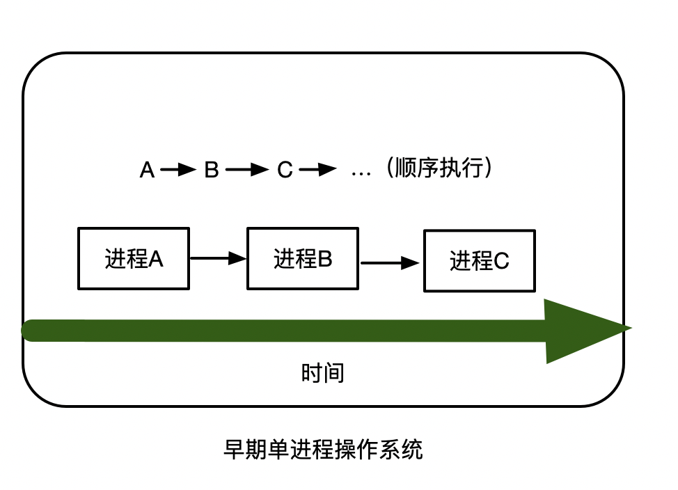

早期操作系统，顺序执行任务，同一时刻只能执行同一个进程的效果，是一个单进程操作系统，因为cpu  只有一个核，只能同时处理一个指令。

### 单进程时代的两个问题

1. 单一执行流程、计算机只能一个任务一个任务的处理
2. 进程阻塞所带来的cpu浪费问题

**问题： 能不能宏观的执行多个任务呢？**

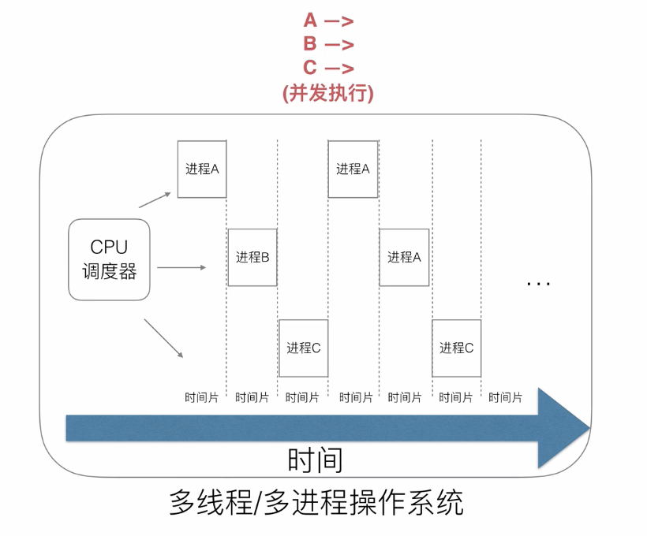
cpu 调度器轮询调度任务，通过时间片将个任务切分。

**多进程/多线程解决了阻塞问题**

**带来了任务切换的问题**
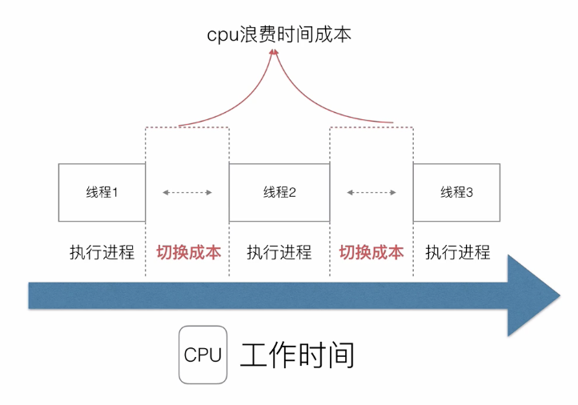

进程/线程的数量越多，切换成本就越大，也就越浪费。

cpu 的利用率下降。
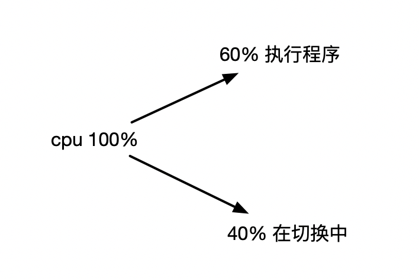

当前系统优化的重要部分就是提高cpu 的利用率。

多线程随着同步竞争（如：锁，竞争资源冲突等）是的开发设计变得越来越复杂。

多进程/多线程的壁垒 cpu 的高消耗和高内存占用。

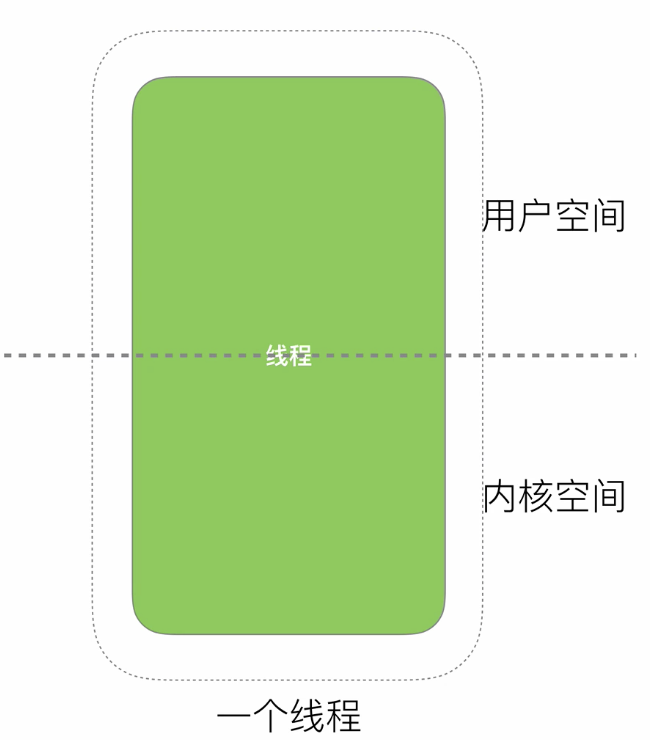
一个线程分为 内核空间和用户空间，内核态表示操作系统底层，包括进程开辟，分配物理内存资源、分配磁盘资源等等。用户空间就是上层的业务逻辑。 

将线程一分为2， 用户空间和内核空间，内核线程专门用于处理硬件相关任务，用户线程用于处理业务层面的任务。

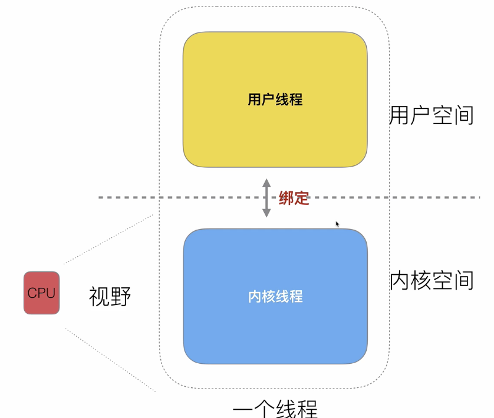
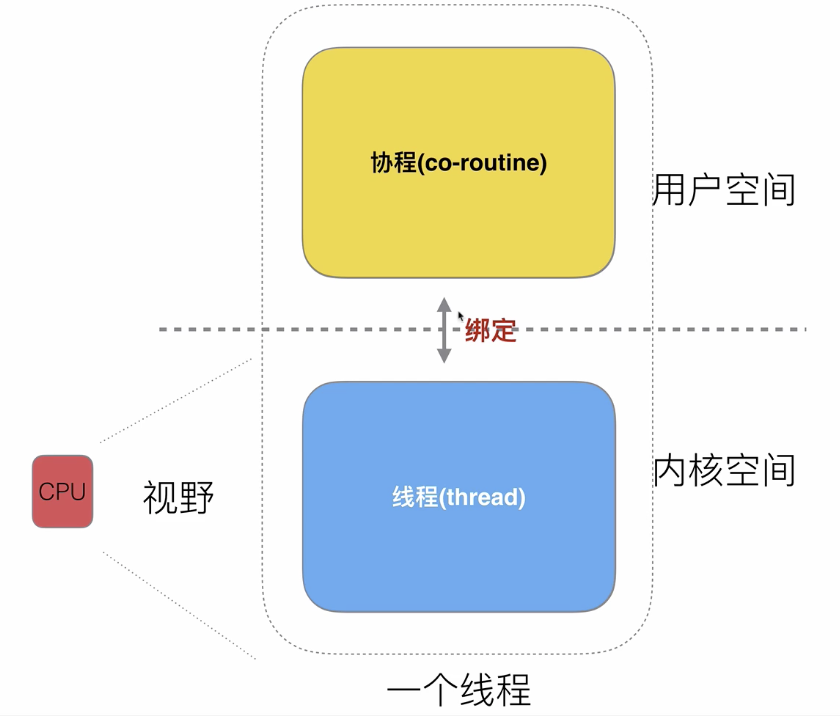

用户线程通过协程调度器绑定多个协程。如：
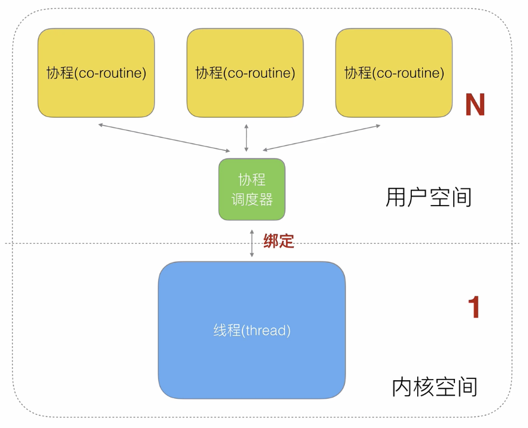
通过上层 绑定多个协程，每个协程都去挂在一个任务，这样用户态可以保证一个并发效果，而cpu 本身不需要切换，这样解决了cpu高消耗调度的瓶颈。

**这种 n:1的协程绑定关系有什么弊端呢？**
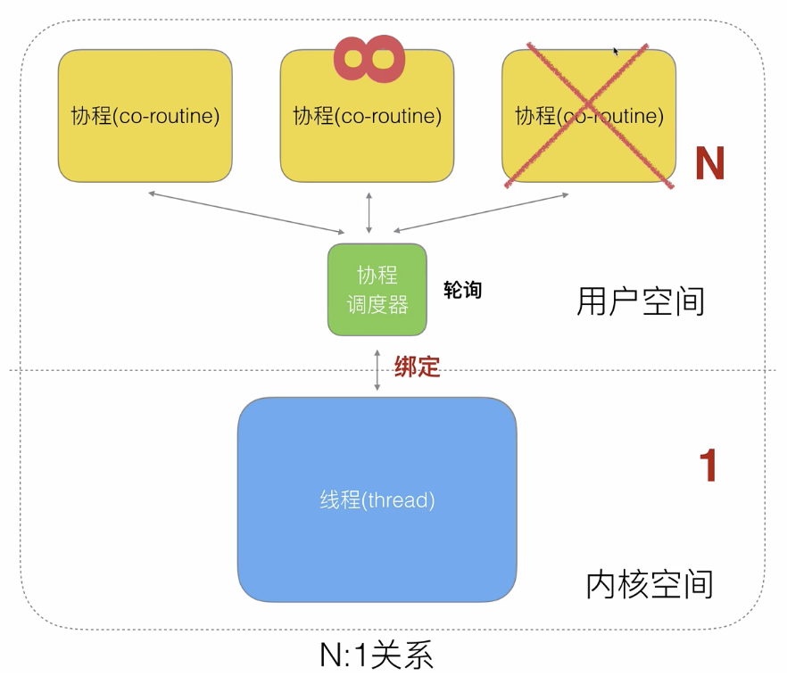
如图：当一个协程阻塞之后，会影响其他线程的阻塞。

**如果还是1:1的关系？**
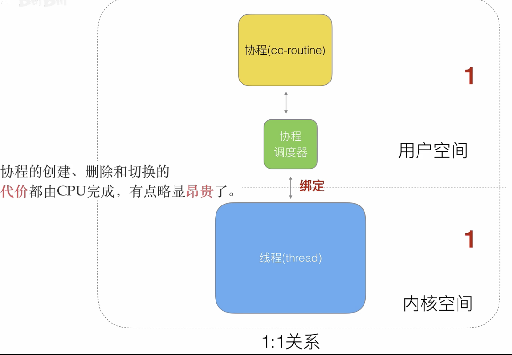
没有阻塞的效果，但是回到了线程的级别， 一个cpu所处的线程和用户线程在同一个级别，当处理并发任务的时候，需要切换底层的线程；还是有高切换的成本。

**最后演化 m:n的关系**
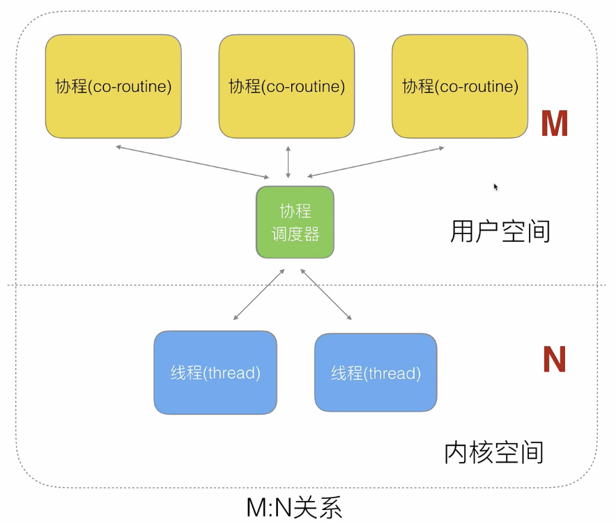

### golang 对协程的处理

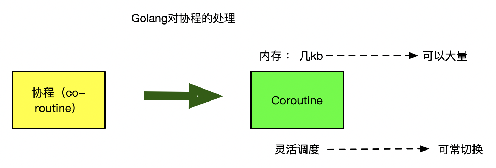
1. 将co-routine 该名为 groutine
2. 将协程所占内存空间改小 为 几kb,将多余的不必要的空间都砍掉，所占空间变小，意味着可以大量创建。
3. 灵活调度，可经常切换。

**golang 对早期调度器的处理**

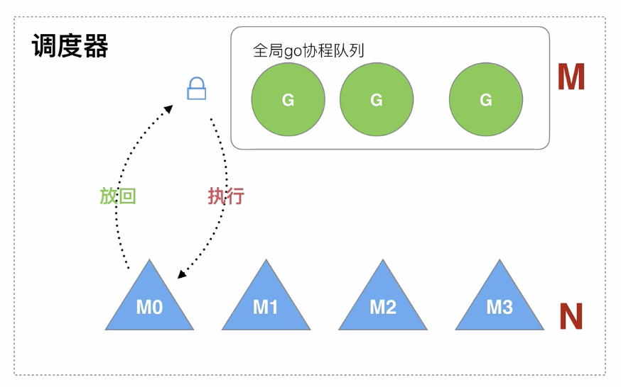
假如四个内核线程，一个goroutine队列，当m 调度队列时候，首先会获取goroutine的全局保护锁，获取到之后会将 g 调度到m上去执行，执行完之后，还锁，并将g放到队列尾部，以便下次执行。

**老调度器有几个缺点**
* 创建、销毁、调度G都需要每个M 获取锁，这就形成了激烈的锁竞争。
* M转移G 会造成延迟和额外的系统负载
* 系统调用（cpu在M之间的切换）导致频繁的线程阻塞和取消阻塞操作增加了系统开销。
