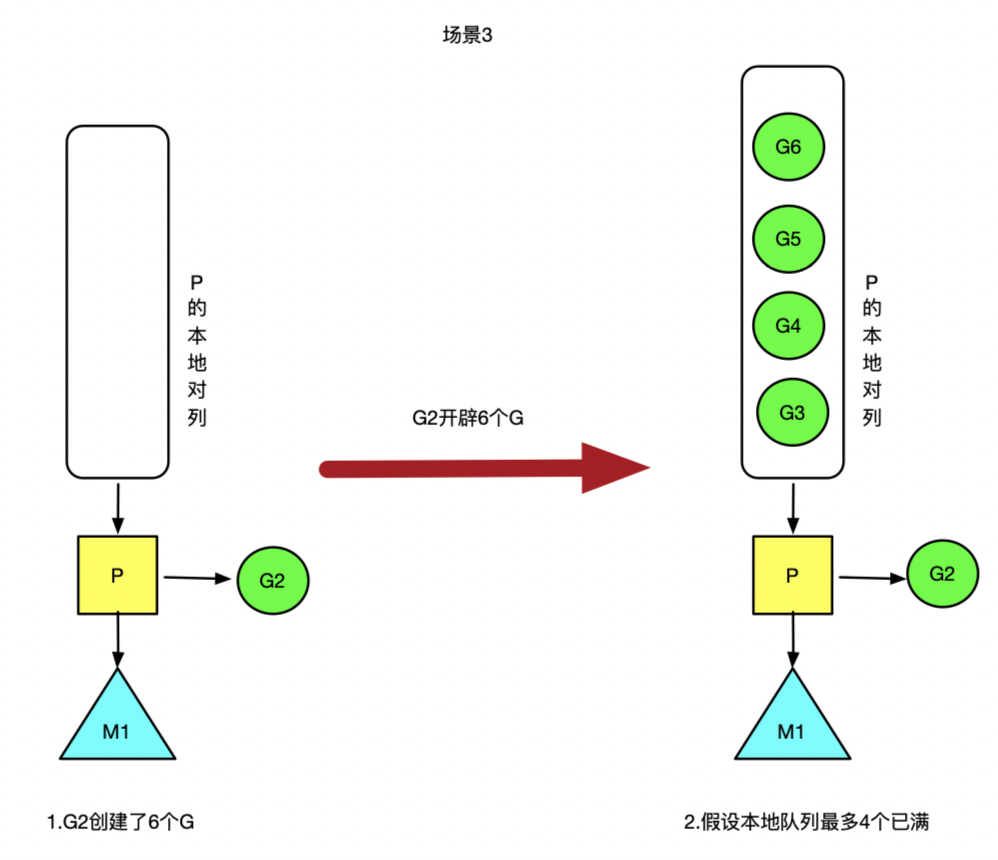
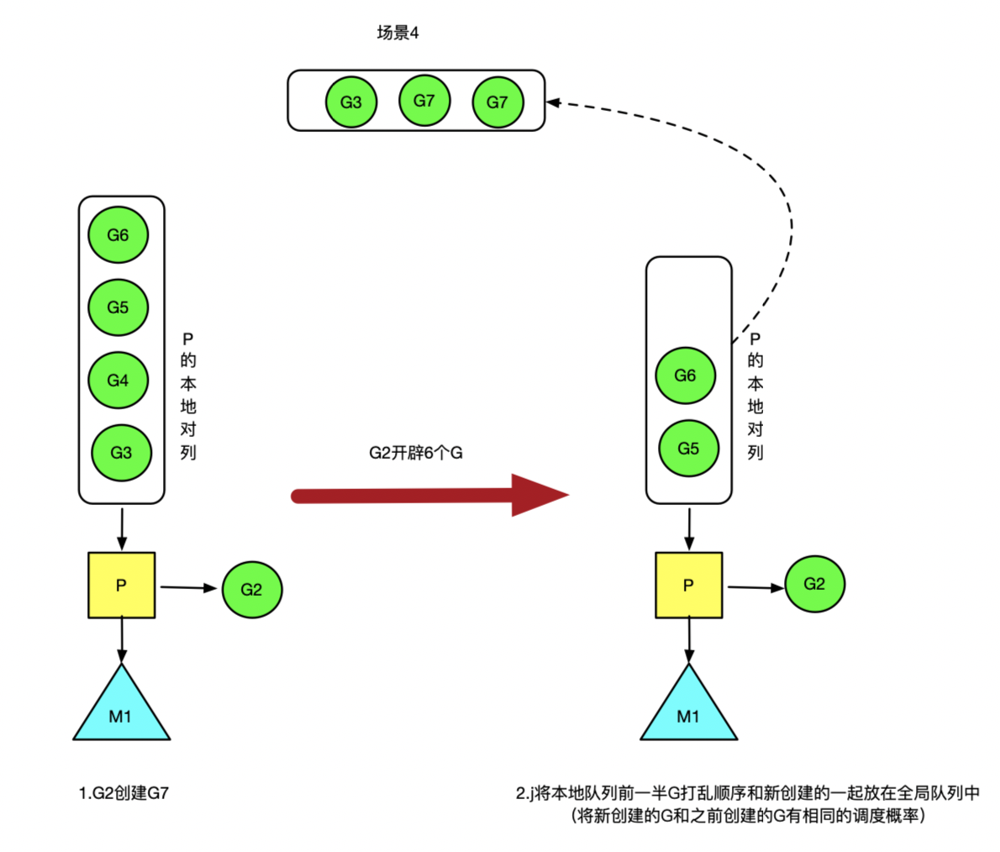
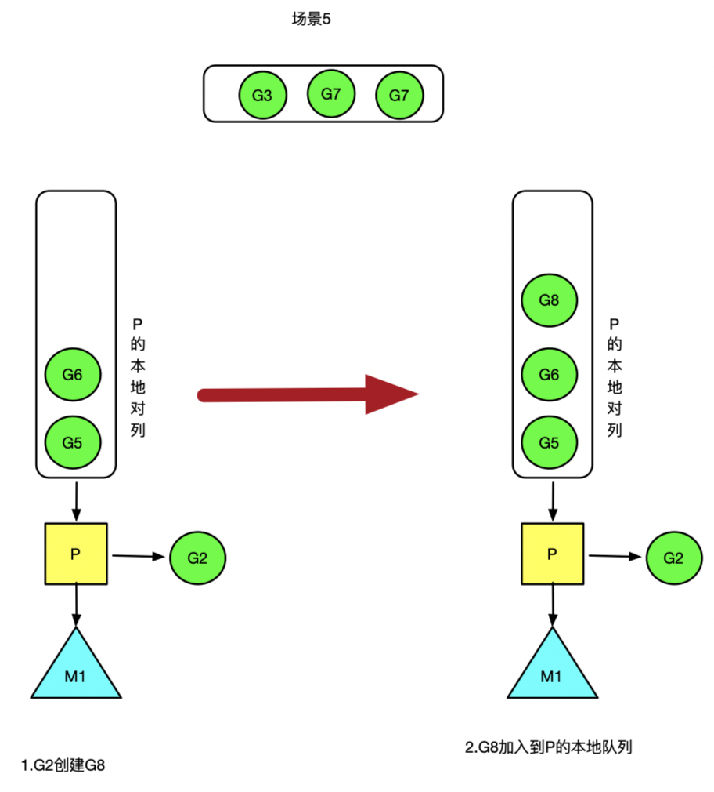
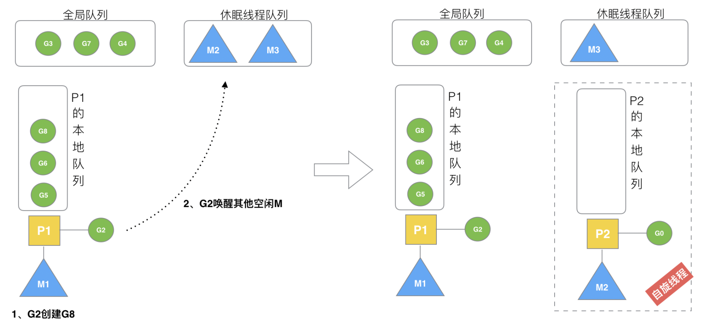

## G2开辟过多的G

### 场景3

假设每个P的本地队列只能存4个G。G2要创建了6个G,前3个G（G3, G4，G5，G6）加入p1的本地队列，p1的本地队列满了。

### 场景4

G2在创建G7的时候，发现P1的本地队列为空，需要执行负载均衡（把P1中本地队列中前一半G，还有新创建的G转移到全局队列）

（实现中并不一定是新的G，如果G是G2之后就执行的，会被保存在本地队列，利用某个老的G替换新G加入全局队列）

这些G被转移到全局队列时，会被打乱顺序。所以G3,G4,G7被转移到全局队列。

### 场景5

G2创建G8时，P1的本地队列未满，所以G8会被加入到P1的本地队列。

G8加入到P1点本地队列的原因还是因为P1此时在与M1绑定，而G2此时是M1在执行。所以G2创建的新的G会优先放置到自己的M绑定的P上。

### 场景6

在创建G时，运行的G会尝试唤醒其他空闲的P和M组合去执行。

假定G2唤醒了M2，M2绑定了P2，并运行G0，但P2本地队列没有G，M2此时为自旋线程（没有G但为运行状态的线程，不断寻找G）。