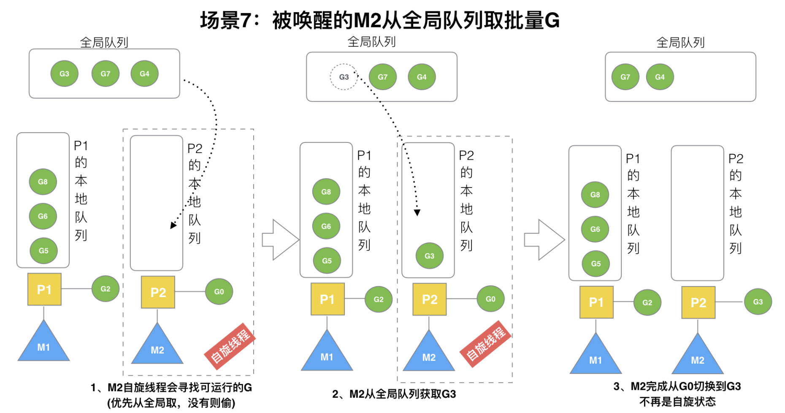

> 原教程地址:https://www.bilibili.com/video/BV19r4y1w7Nx?p=13 \
> 作者:刘丹冰Acel
## 场景7: 唤醒的M2从全局队列中取批量G

M2尝试从全局队列(简称“GQ”)取一批G放到P2的本地队列（函数：findrunnable()）。M2从全局队列取的G数量符合下面的公式：
```
n = min(len(GQ)/GOMAXPROCS + 1, len(GQ/2))
```

至少从全局队列取1个g，但每次不要从全局队列移动太多的g到p本地队列，给其他p留点。这是从全局队列到P本地队列的负载均衡。


假定我们场景中一共有4个P（GOMAXPROCS设置为4，那么我们允许最多就能用4个P来供M使用）。所以M2只从能从全局队列取1个G（即G3）移动P2本地队列，然后完成从G0到G3的切换，运行G3。