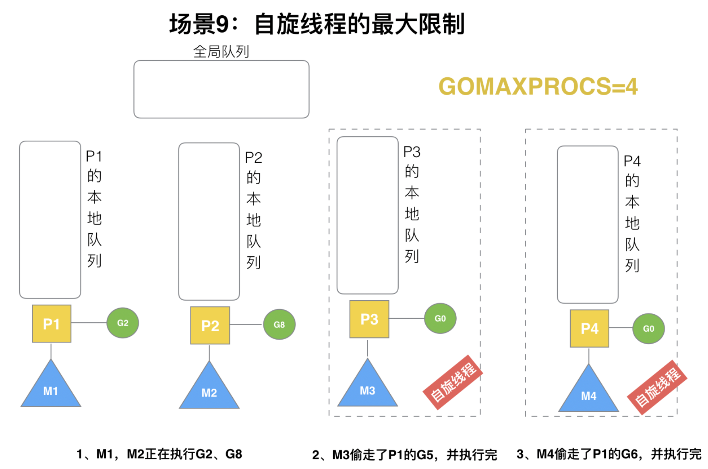

> 原教程地址:https://www.bilibili.com/video/BV19r4y1w7Nx?p=15 \
> 作者:刘丹冰Acel

### 场景9: 自旋线程的最大限制

G1本地队列G5、G6已经被其他M偷走并运行完成，当前M1和M2分别在运行G2和G8，M3和M4没有goroutine可以运行，M3和M4处于自旋状态，它们不断寻找goroutine。

为什么要让m3和m4自旋，自旋本质是在运行，线程在运行却没有执行G，就变成了浪费CPU. 为什么不销毁现场，来节约CPU资源。因为创建和销毁CPU也会浪费时间，我们希望当有新goroutine创建时，立刻能有M运行它，如果销毁再新建就增加了时延，降低了效率。当然也考虑了过多的自旋线程是浪费CPU，所以系统中最多有GOMAXPROCS个自旋的线程(当前例子中的GOMAXPROCS=4，所以一共4个P)，多余的没事做线程会让他们休眠。