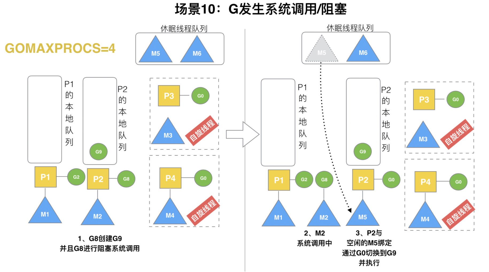

> 原教程地址:https://www.bilibili.com/video/BV19r4y1w7Nx?p=16 \
> 作者:刘丹冰Acel

### 场景10: G发生系统调用/阻塞

假定当前除了M3和M4为自旋线程，还有M5和M6为空闲的线程(没有得到P的绑定，注意我们这里最多就只能够存在4个P，所以P的数量应该永远是M>=P, 大部分都是M在抢占需要运行的P)，G8创建了G9，G8进行了阻塞的系统调用，M2和P2立即解绑，P2会执行以下判断：如果P2本地队列有G、全局队列有G或有空闲的M，P2都会立马唤醒1个M和它绑定，否则P2则会加入到空闲P列表，等待M来获取可用的p。本场景中，P2本地队列有G9，可以和其他空闲的线程M5绑定。