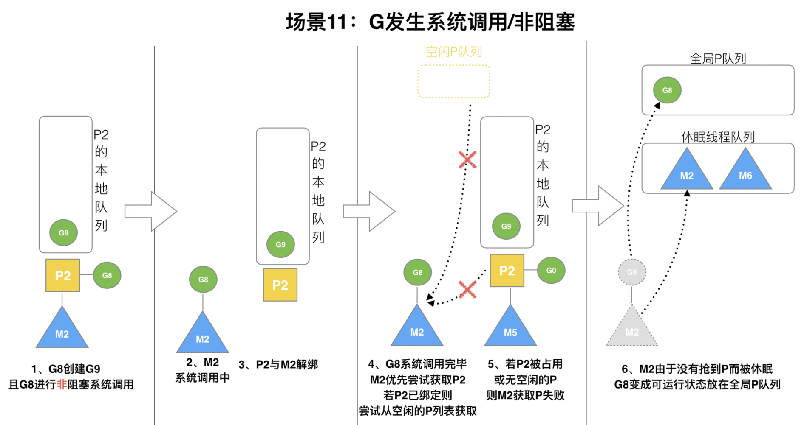

> 原教程地址:https://www.bilibili.com/video/BV19r4y1w7Nx?p=17 \
> 作者:刘丹冰Acel

### 场景11: G发生系统调用/非阻塞

G8创建了G9，假如G8进行了非阻塞系统调用。

​ M2和P2会解绑，但M2会记住P2，然后G8和M2进入系统调用状态。当G8和M2退出系统调用时，会尝试获取P2，如果无法获取，则获取空闲的P，如果依然没有，G8会被记为可运行状态，并加入到全局队列,M2因为没有P的绑定而变成休眠状态(长时间休眠等待GC回收销毁)。