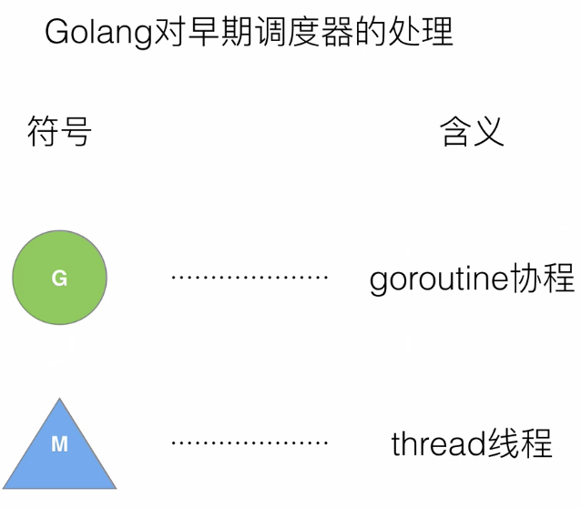
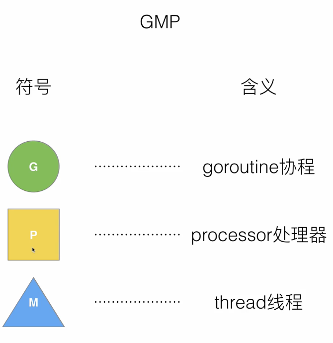
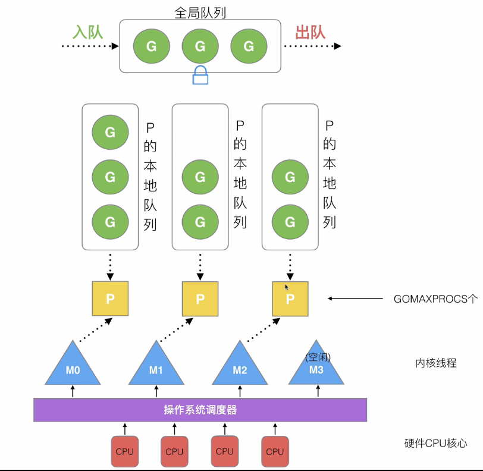

> 原教程地址:https://www.bilibili.com/video/BV19r4y1w7Nx?p=3 \
> 作者:刘丹冰Aceld
## 什么是G M P
* G: Groutine
* P: Processor 处理器
* M: thread 线程

## 什么是 GMP 模型？
硬件cpu 核心层提供以硬件支持，操作系统内部会有操作系统调度器专门 用来调度cpu,在操作系统调度器中可以用来调度线程，这一层为内核下面的调度方式用来调度线程，再上一层为用户态，每个线程上面都会有个p,每个p 都会保存一个真正的进程或者说每个程序的全部goroutine资源（包括栈 堆和一些数据）。p 的个数并不是固定的， 可以通过GOMAXPROCS 设置。每个p 包含本地可运行的G队列。除了本地队列外，还有一个全局队列，全局队列实际上存放的是等待运行的goroutine。如：

