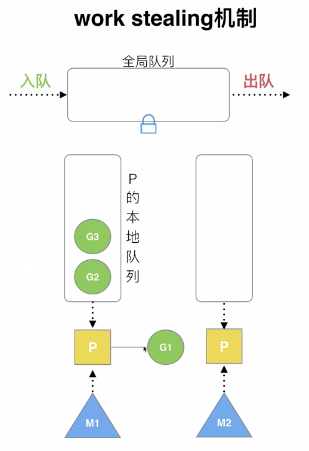
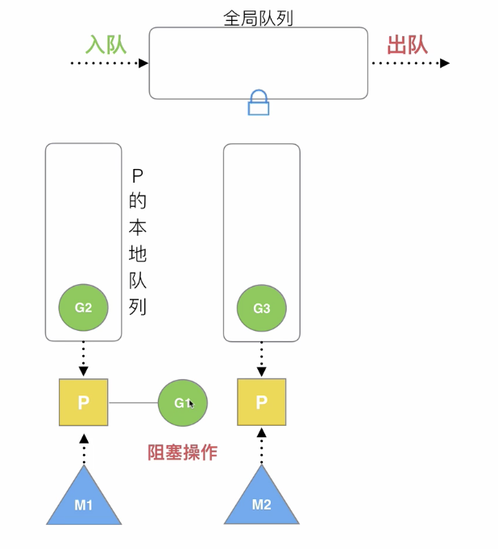
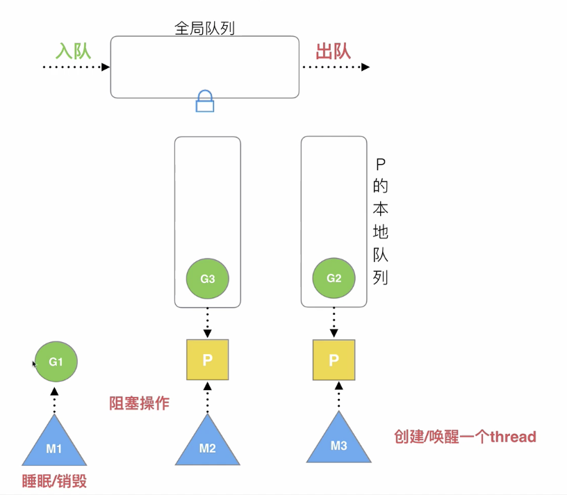
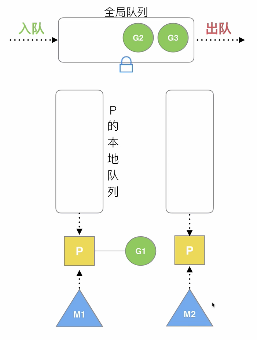
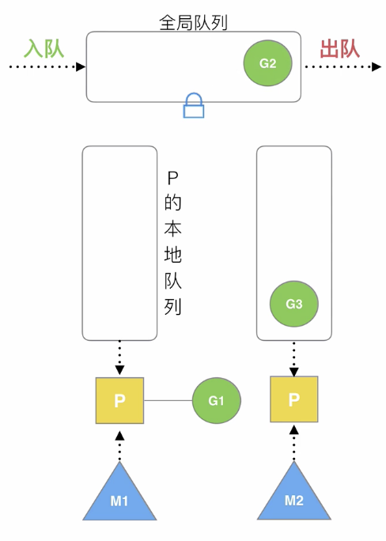

> 原教程地址:https://www.bilibili.com/video/BV19r4y1w7Nx?p=4 \
> 作者:刘丹冰Aceld
## 调度器的设计策略
* 复用线程
* 利用并行
* 抢占
* 全局G队列

## 复用线程
* work stealing 机制

如图：M1和P绑定，此时G1协程正在被执行，G2和G3协程在本地队列等待被运行。此时M2线程空闲，但M2绑定但P本地队里为空，没有协程，需要从其他队列中偷取一个G运行，来保证资源平衡。

当本线程无可运行对G 时尝试从其他线程绑定对P偷取G,而不是销毁线程

* hand off 机制

M1与P 绑定，此时G1正在运行，其本地队列中G2正在等待运行，而M2绑定但P即将要运行G3。假如G1发生阻塞，就会将M1与P发生分离，重新创建或者唤醒一个新的thread M3，将原来与M1 绑定但P 移动到M3上继续运行。 此时G1与M1会进行绑定，G1 运行完之后，M1 会进行睡眠或者销毁。

当本线程 因为G运行系统调用阻塞时，线程会释放绑定的P,把P转移给其他空闲的线程执行

## 利用并行
* GOMAXPROCS 限定P的个数
* P数量 = cpu 核数 / 2

GOMAXPROCS 设置P的 数量，最多有GOMAXPROCS个线程分布在多个cpu上同时运行。

## 抢占

**之前的调度器**

co-routine与cpu 进行绑定，cpu在处理协程，如果此时有其他的c1,也在等待cpu的资源，如果绑定cpu的的c不主动释放，那么c1将永远等待，直到cpu被主动释放才能获取到运行资源

**现在的调度器**

goroutine方式：
goroutine也是与cpu 进行绑定，但在绑定轮询执行过程中，每个G最多轮询10ms,如果时间到了，不管是否主动释放，新的G一定会抢占CPU资源

在coroutine 中要等待一个协程主动让出cpu才能执行下一个协程，在 go中，一个goroutine最多占用CPU 10ms，防止其他groutine 被饿死。

## 全局G队列
当M绑定的P中，本地队列为空时，此时会从全局队列中获取G运行，获取过程中需要加锁和解锁。如：

当M 执行work stealing 从其他p偷不到G时，它可以从全局G队列获取G。