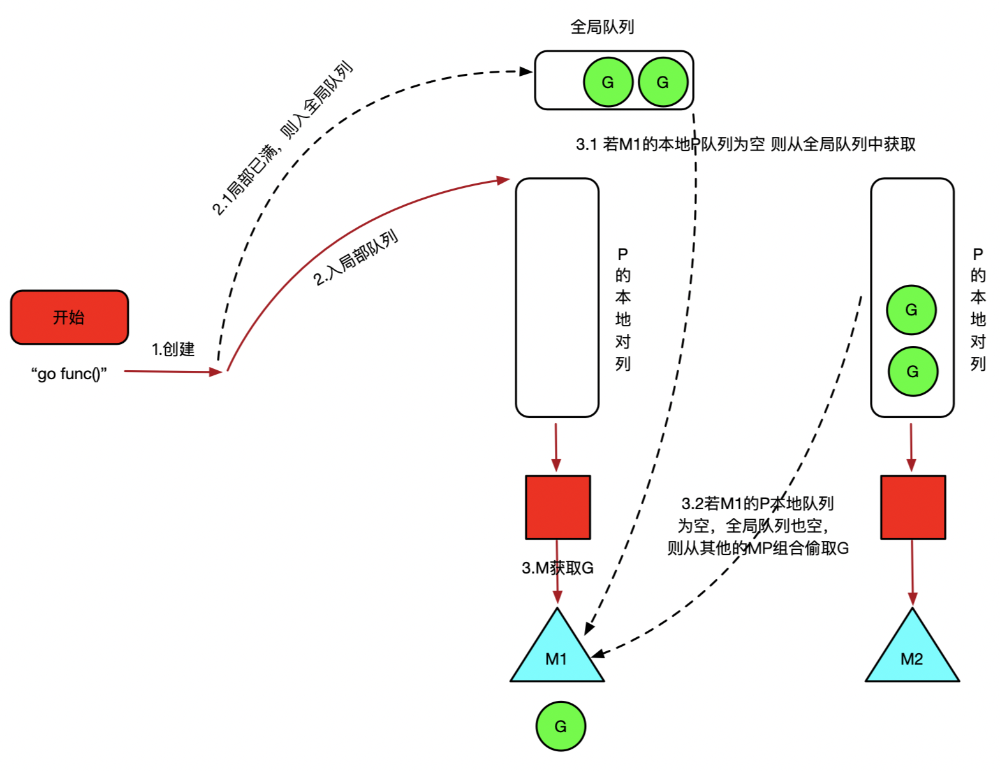
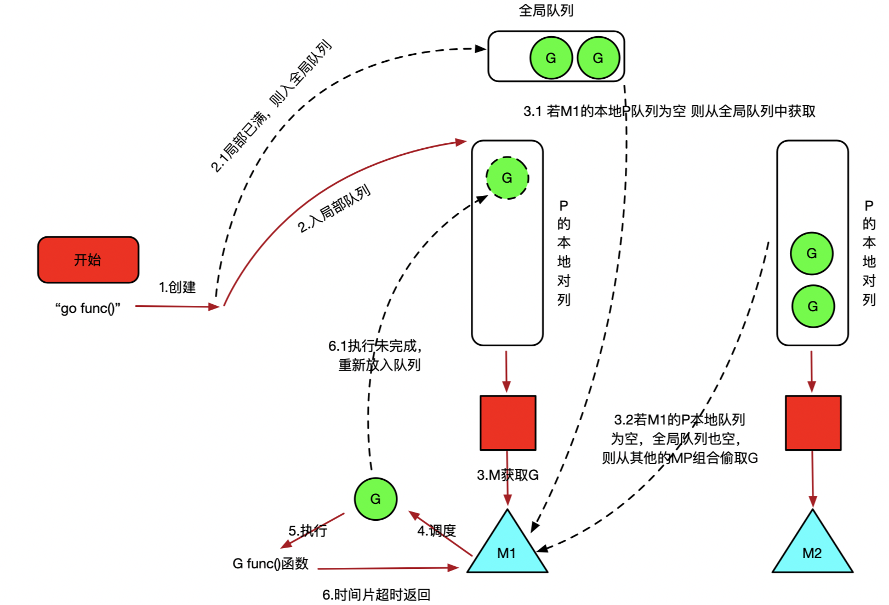
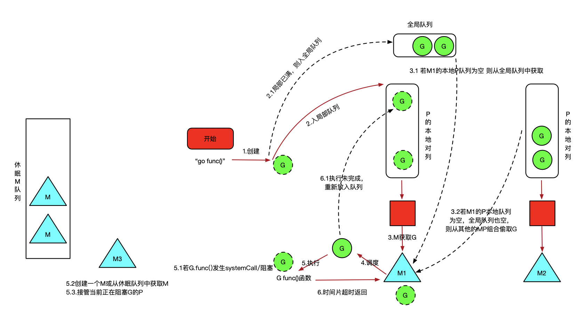
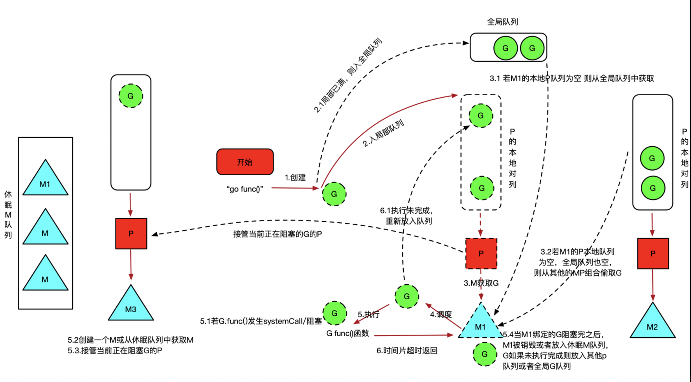

> 原教程地址:https://www.bilibili.com/video/BV19r4y1w7Nx?p=5 \
> 作者:刘丹冰Aceld
## go func()指令的调度流程

1. 通过go func()创建一个goroutine
2. 有两个存储G的队列，一个局部调度p的本地 队列，一个是全局G队列，新创建的G会先保存在 p的本地队列中，如果p的本地队列已满，就会保存在全局的队列中
3. G只能运行在M中，一个M必须有一个P，M与P的关系 1:1，M会从P的本地队列中弹出一个可执行的G来执行，如果P的本地队列为空，就会从其他的MP组合中偷取一个可执行的G来执行
4. 一个M调度G执行的过程是一个循环机制
5. 当M执行某一个G如果发生syscall或者其余阻塞操作，M会阻塞，如果当前 有一些G在执行，runtime会把这个线程M从P中摘除（detach）,然后再创建一个新的操作系统的线程（如果有空闲的线程可用，就复用空闲的线程）来服务这个p
6. 当M系统调用结束时候，这个G会尝试获取一个空闲的P执行，并放到这个p的本地队列，如果获取不到P，那么这个线程M变成休眠状态，加入到空闲线程中，然后这个G会被放入全局队列中。

如图：
**一：**

**二：**

**三：**

**四：**
