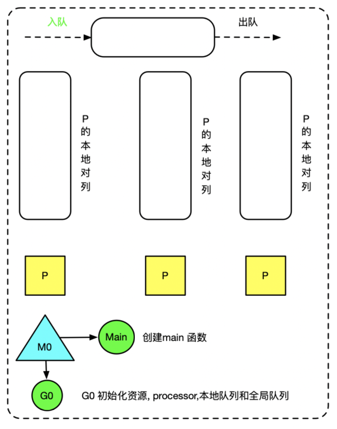
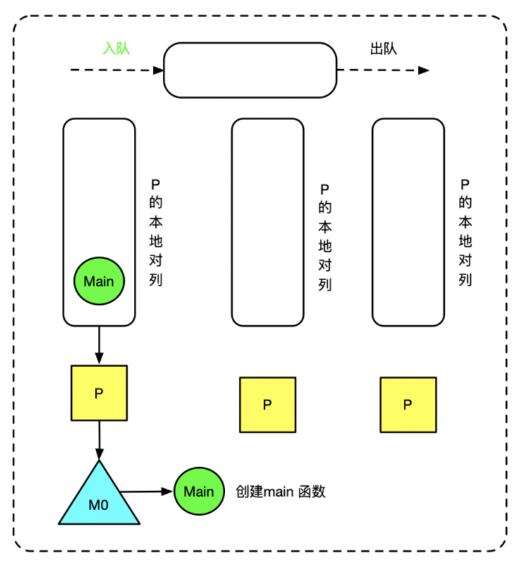
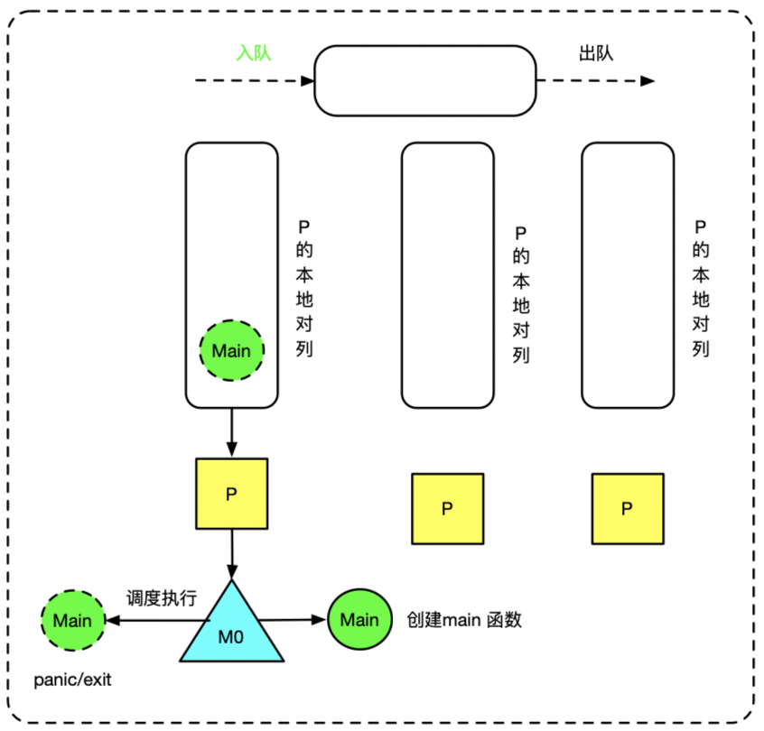

> 原教程地址:https://www.bilibili.com/video/BV19r4y1w7Nx?p=6 \
> 作者:刘丹冰Aceld
## go的启动周期

### M0 & G0介绍

#### M0

* 启动程序后的编号为0的主线程
* 在全局变量runtime.m0中 ，不需要在 heap上分配
* 负责执行初始化操作和启动第一个G
* 启动第一个G之后,M0就和其他的M一样了。

#### G0

* 每次启动一个M，都会第一个创建的Groutine，就是G0
* G0仅用于负责调度其他的G(用于保存调度的栈的信息，提供环境)
* G0不指向任何可执行的函数
* 每个M都会有一个自己的G0
* 在调度或者系统调用时，会使用G0的栈空间，M先切换到G0，来调度

**M0和G0会存放在全局空间**

### main 函数执行流程
```
package main

import "fmt"

func main() {
    fmt.Println("hello world")
}
```

> * 首先程序启动时会启动M0和G0，G0用于初始化系统资源，processor 和 本地p队列，全局G队列等。
> * 创建Main函数,此时Main 函数需要调度到M 上执行，而G0与M0解绑，M0需要与空闲的P绑定，并将Main函数放P队列
> * M0 则从P队列中获取Main 函数到M上循环执行。直到Main 函数执行完毕或者遇到panic/exit 退出。



