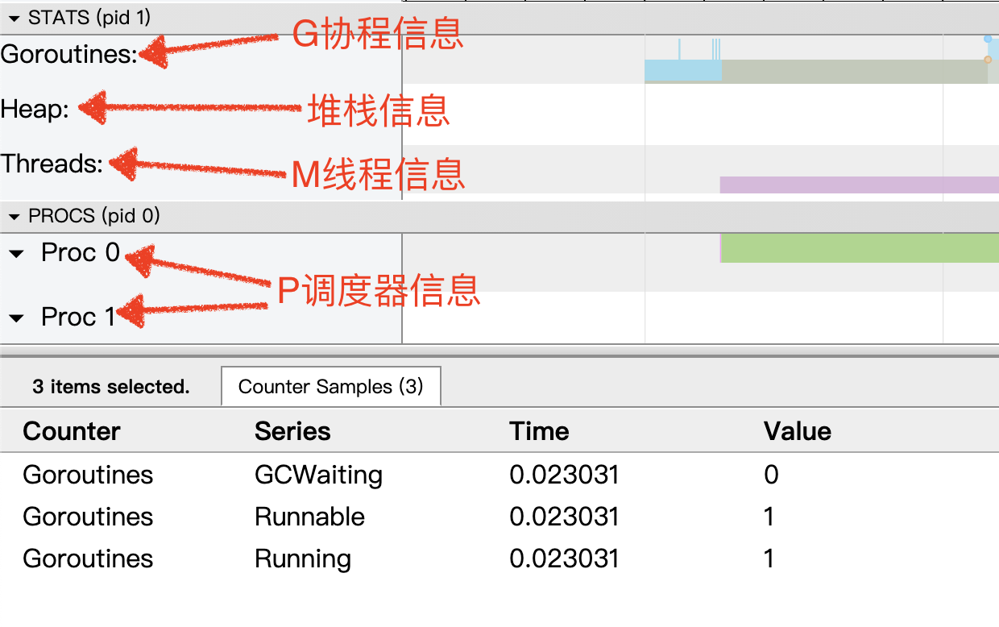
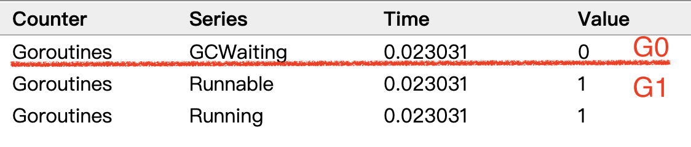
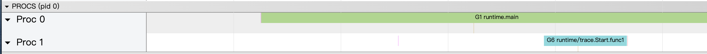

> 原教程地址:https://www.bilibili.com/video/BV19r4y1w7Nx?p=7 \
> 作者:刘丹冰Aceld
## GMP可视化

### GMP trace 过程
1. 创建trace 文件
2. 启动trace
3. 停止trace

实例代码如下：
```
package main

import (
	"fmt"
	"os"
	"runtime/trace"
)

// trace 过程
// 1. 创建trace 文件
// 2. 启动trace
// 3. 停止
func main() {
	// 1. 创建trace 文件
	f, err := os.Create("trace.out")
	if err != nil {
		panic(err)
	}
	// 2. 启动trace
	err = trace.Start(f)
	if err != nil {
		panic(err)
	}
	// 正常调试的代码
	fmt.Println("hello GMP")
	// 3. 停止
	trace.Stop()
}
```

go run 之后会得到一个trace.out 文件

**查看trace.out 文件**
go tool trace trace.out

此时会随机坚挺一个端口，如：http://127.0.0.1:65322

点击 "View trace" 即可看到 GMP 模型过程


**G的信息**


**M的信息**


**P的信息**
