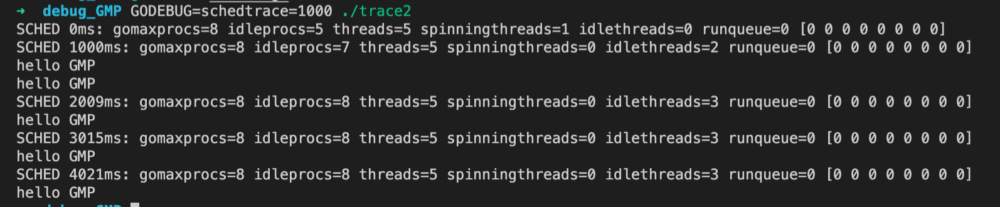

## GMP终端GODEBUG调试

**GODEBUG=schedtrace=1000 ./可执行文件**
> 表示每隔1000ms 打印出调试信息

```
package main

import (
	"fmt"
	"time"
)

func main() {
	for i := 0; i < 5; i++ {
		time.Sleep(time.Second)
		fmt.Println("hello GMP")
	}
}
```

go build

GODEBUG=schedtrace=1000 ./trace


### 信息说明

* SCHED 调试信息
* 0ms 程序从启动到输出所经历的时间
* gomaxprocs p的数量，默认为操作系统的核心数
* idleprocs 处于idle 状态的p的数量。 gomaxprocs-idleprocs = 目前正在执行的p的数量
* threads 全部的线程数量（包含m0和GODEBUG调试的线程）
* spinningthreads 处于自旋状态的thread数量
* idlethreads 处于idle 状态的thread
* runqueue 全局G队列中的等待运行的G的数量
* [0 0 0 0 0 0 0 0] 每个p的local queue 本地队列中G的数量