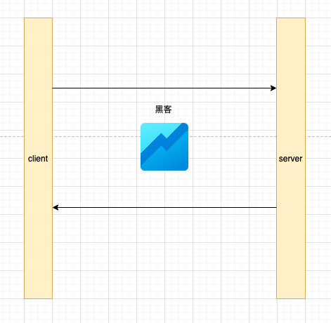

## https和保证传输安全？

在使用HTTP协议传输过程中，数据都是明文传输，丝毫没有安全性可言，而HTTPS(HTTP over SSL/TLS)是如何保证传输安全的呢？主要就是基于SSL/TLS做的多项加密验证措施。

## 基本概念
* 密钥对：在非对称加密技术中，有两种密钥，分为私钥和公钥，私钥是密钥对所有者持有，不可公布，公钥是密钥对持有者公布给他人的。
* 公钥：公钥用来给数据加密，用公钥加密的数据只能使用私钥解密
* 私钥：如上，用来解密公钥加密的数据。
* 摘要：对需要传输的文本，做一个HASH计算，一般采用SHA1，SHA2来获得
* 签名：使用私钥对需要传输的文本的摘要进行加密，得到的密文即被称为该次传输过程的签名。（看最下面的一部分就明白了）
* 签名验证：数据接收端，拿到传输文本，但是需要确认该文本是否就是发送发出的内容，中途是否曾经被篡改。因此拿自己持有的公钥对签名进行解密（密钥对中的一种密钥加密的数据必定能使用另一种密钥解密。），得到了文本的摘要，然后使用与发送方同样的HASH算法计算摘要值，再与解密得到的摘要做对比，发现二者完全一致，则说明文本没有被篡改过。
* 加密：是将数据资料加密，使得非法用户即使取得加密过的资料，也无法获取正确的资料内容，所以数据加密可以保护数据，防止监听攻击。其重点在于数据的安全性。

## 加密算法

### 对称加密

“对称加密”就是指加密和解密时使用的密钥都是同一个，是“对称”的。只要保证了密钥的安全，那整个通信过程就可以说具有了机密性。但通常效率较低。

如图：

### 非对称加密

非对称加密两个密钥，一个叫“公钥”（public key），一个叫“私钥”（private key）。两个密钥是不同的，“不对称”，公钥可以公开给任何人使用，而私钥必须严格保密。

公钥和私钥有个特别的“单向”性，虽然都可以用来加密解密，但公钥加密后只能用私钥解密，反过来，私钥加密后也只能用公钥解密。

如图：

### HTTP阶段

在http 阶段使用明文传输，黑客很容易从中间截取消息，获取到账号密码等关键数据信息，也就无法保证数据安全。

如图：

### HTTPS 阶段

HTTPS（HTTP over SSL/TLS），关键在 SSL/TLS

SSL/TLS:SSL 即安全套接层（Secure Sockets Layer）, TLS 由记录协议、握手协议、警告协议、变更密码规范协议、扩展协议等几个子协议组成，综合使用了对称加密、非对称加密、身份认证等许多密码学前沿技术。 保证了消息的：机密性、完整性，身份认证和不可否认。

#### 对称加密和非对称加密 - 机密性

如何保证传输的机密性？

对称加密：密钥问题无法解决。成千上万的客户端，一旦使用同一个密钥，就无法做到真正的安全，黑客也是客户端，也能拿到密钥，一旦拿到密钥，就可以破解任意加密数据。如果要保证安全性，需要每次回话都要有不同的密钥，而这个密钥，需要客户端和服务端都知道，否则就无法实现加密或者解密，而成成千上万的密钥怎么实现客户端和服务端的保存，是一个问题，保存起来，也会浪费巨大的内存空间。

非对称加密：非对称加密

#### 摘要算法 - 完整性的保证

