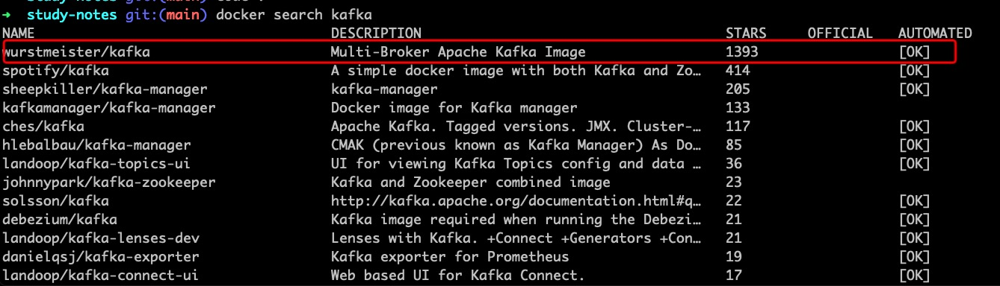
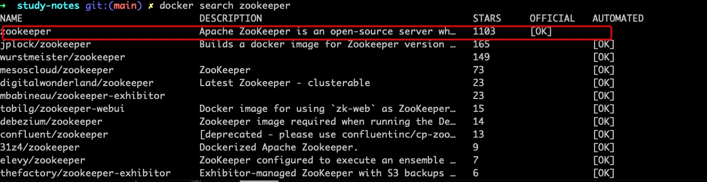
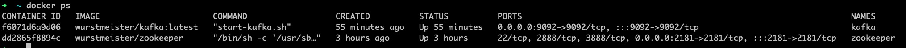
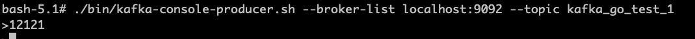
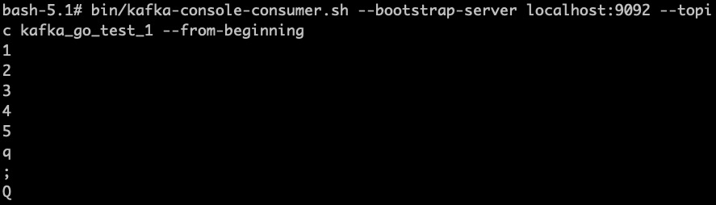

## kafka 介绍及安装


### docker 安装 kafka

#### 拉去镜像

```
docker search kafka
```



拉取kafka镜像

```
docker pull wurstmeister/kafka
```

同样的操作安装zookeeper



```
docker pull zookeeper
```

#### 创建并启动容器

启动zookeeper

```
docker run -d --name zookeeper -p 2181:2181 -t zookeeper
```

启动kafka
```
docker run -d --name kafka --publish 9092:9092 --link zookeeper --env KAFKA_ZOOKEEPER_CONNECT=zookeeper:2181 --env KAFKA_ADVERTISED_HOST_NAME=你的宿主ip --env KAFKA_ADVERTISED_PORT=9092 --volume /etc/localtime:/etc/localtime wurstmeister/kafka:latest
```

**注意：启动kafka容器时 需要将宿主ip换成你自己的**

通过一下命令来查看是否运行成功

```
docker ps      //查看当前运行的容器
docker ps -a   //查看所有的容器(包括未运行的)
```



### kafka 生产者消费者测试

#### 进入容器：

```
docker exec -it 你的kafka容器id /bin/bash
```

进入 /opt/kafka_2.13-2.7.0/ 目录

#### 创建一个topic

创建一个topic 名为test01


```
bin/kafka-topics.sh --create --zookeeper zookeeper:2181 --replication-factor 1 --partitions 1 --topic test01
```

#### 查看topic列表

```
bin/kafka-topics.sh --list --zookeeper zookeeper:2181  //查看我们的topic列表
```

#### 生产者消费者测试

创建生产者

```
bin/kafka-console-producer.sh --broker-list localhost:9092 --topic test01
```



创建一个消费者接收消息

```
bin/kafka-console-consumer.sh --bootstrap-server localhost:9092 --topic test01 --from-beginning
```




### 参考

http://blog.70ci.com/post/736.html