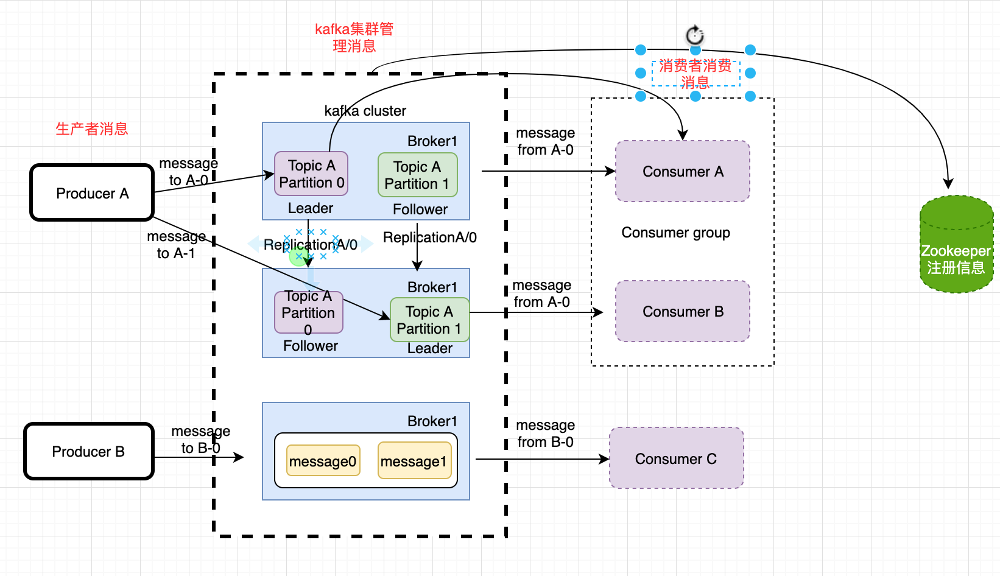

## kafka

### 传递模式

两种主要的消息传递模式：
* 点对点传递 (一对一)
* 发布-订阅 （一对多）
    * 消费者主动拉数据
    * 队列主动推数据

### 发布 - 订阅 不同模式的优缺点

#### 队列主动推数据

各个消费者消费的速率不一样，推的速度一样，有可能消息不对等，部分消费者能力处理不足，导致崩了，部分消费者资源浪费。

#### 消费者主动拉数据

根据自己的消费能力去拉取消息，但是需要维护一个长轮训，不断的去询问数据。

#### kafka基础架构

* Broker: kafka集群是有broker 组成，每个broker是一个kafka 节点
* Topic: 每个broker 上有 topic 主题（相当于消息分类）
* Partition: 每个topic 有多个partition 分区
* segment: 一个partition当中存在多个segment文件段，每个segment分为两部分，.log文件和.index文件，其中.index文件是索引文件，主要用于快速查询.log文件当中数据的偏移量位置

将同一Topic的不同partition 放在不同的broker上，有助于提高kafka的负载均衡和并发能力。

某一个分区中的数据只能被同一个消费者组里面的消费者消费

消费者组提高了消费能力

消费者组内消费者个数最好与分区的个数保持一致

kafka集群正常工作需要 Zookeeper，帮助kafka集群存储一些信息，管理整个集群。

消费者也会存储一些东西，如果消费者挂了，当消费者启动时候，需要接着从宕机之前即将消费的地方接着消费。（0.9版本offset之前存储在ZK， 之后存储在kafka 由系统维护）

### 术语介绍

