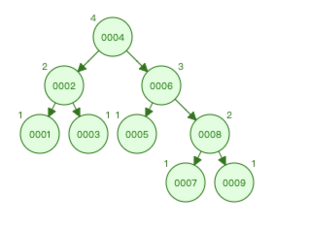
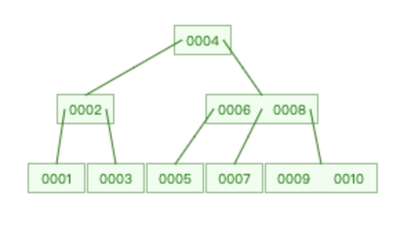
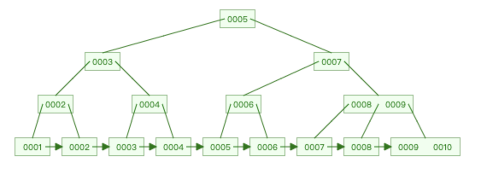

## mysql 索引

索引提高了查询效率，mysql 内置了hash 索引和 B+树索引。


### 平衡二叉树



平衡二叉树中树的高度的绝对值不大于1，所以成为平衡二叉树。

缺点：

* 树的高度比较大，随着数据量的增大，树的高度也会增加，树的高度越高，查询效率就慢。
* 当查询大于5的值时，回旋查询导致效率底下。

### B树



树的高度变低，io减少，但无法解决回旋问题。

### hash索引

查询效果最优，时间复杂度 O(1); 但不适合范围查询

哈希表这种结构适用适用于只有等值查询的场景。

### 有序数组


有序数组在等值查询和范围查询场景中的性能都非常优秀。但在需要更新数据的时候就比较麻烦了。，往中间插入一个记录就必须得挪动后面所有的记录，成本太高。

有序数组只适用于静态存储引擎。

### B+树



mysql 按照也存储，以InnoDB整数字段为例，N叉树的N差不多为 1200 （16K / (8b + 6b)), mysql 页存储，默认每页16k

深度为3的数据量为 1200 * 1200 * 1200

叶子节点存储但是数据，非叶子节点存储的主键

非叶子节点存储的是key，不存储value, 而叶子节点存储的是key和value,value是具体数据的地址。

解决了树的高度问题和回旋问题，有效解决了查询效率和返回查找的问题。

### InnoDB 的索引模型

在 InnoDB 中，表都是根据主键顺序以索引的形式存放的，这种存储方式的表称为索引组织表。InnoDB 使用了 B+ 树索引模型，所以数据都是存储在 B+ 树中的。

假设，我们有一个主键列为 ID 的表，表中有字段 k，并且在 k 上有索引。这个表的建表语句是：

```
mysql> create table T(
id int primary key, 
k int not null, 
name varchar(16),
index (k))engine=InnoDB;
```

表中 R1~R5 的 (ID,k) 值分别为 (100,1)、(200,2)、(300,3)、(500,5) 和 (600,6)，两棵树的示例示意图如下。


从图中可以看出，根据叶子节点的内容，索引类型分为主键索引和非主键索引。

主键索引的叶子节点存的是整行数据。在 InnoDB 里，主键索引也被称为聚簇索引（clustered index）。

非主键索引的叶子节点内容是主键的值。在 InnoDB 里，非主键索引也被称为二级索引（secondary index）。

基于主键索引和普通索引的查询有什么区别？

* 如果语句是 select * from T where ID=500，即主键查询方式，则只需要搜索 ID 这棵 B+ 树；
* 如果语句是 select * from T where k=5，即普通索引查询方式，则需要先搜索 k 索引树，得到 ID 的值为 500，再到 ID 索引树搜索一次。这个过程称为回表。

显然，主键长度越小，普通索引的叶子节点就越小，普通索引占用的空间也就越小。