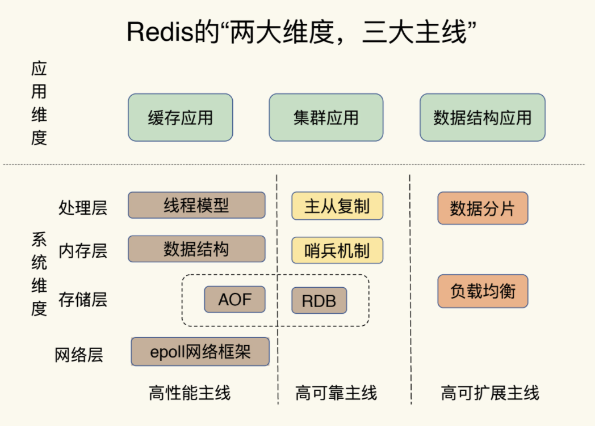
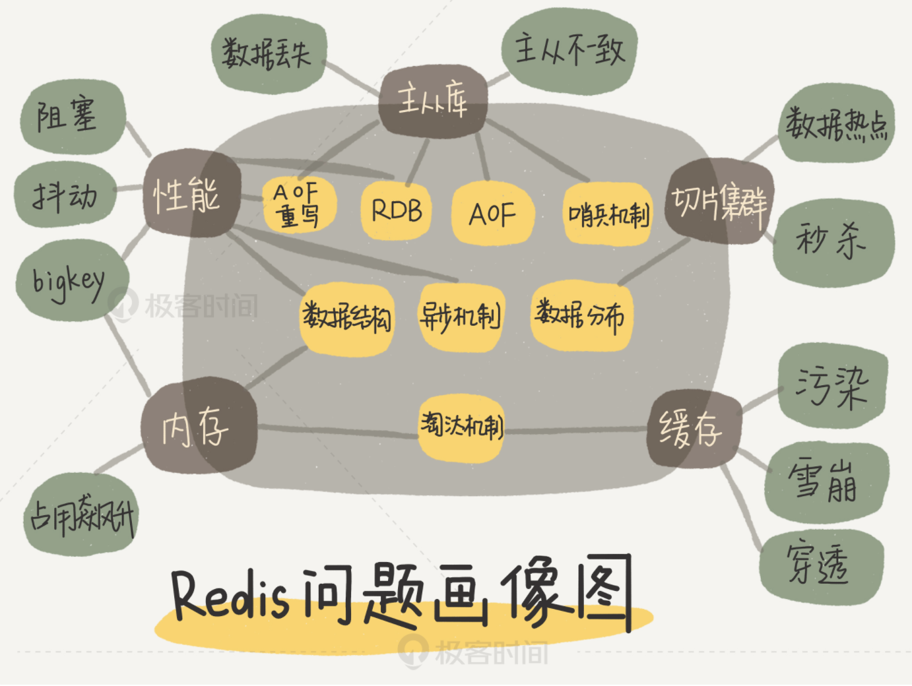

## redis 介绍

### redis 全景介绍

* 两大维度：
    * 应用纬度
    * 系统纬度

* 三大主线：
    * 高性能主线
    * 高可靠主线
    * 高拓展主线

高性能主线：包括线程模型，数据模型，持久化，网络框架
高可靠主线：主从复制，哨兵机制
高可扩展主线：数据分片、负载均衡

* 应用场景驱动
    * 缓存
        * 缓存机制
        * 缓存替换
        * 缓存异常

    * 集群
* 典型案例驱动

