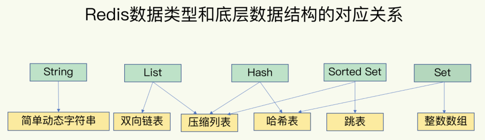
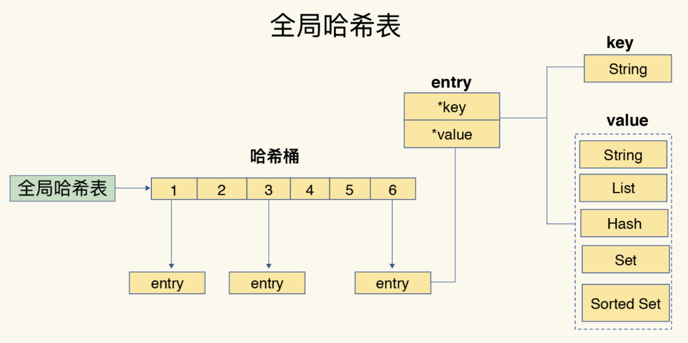
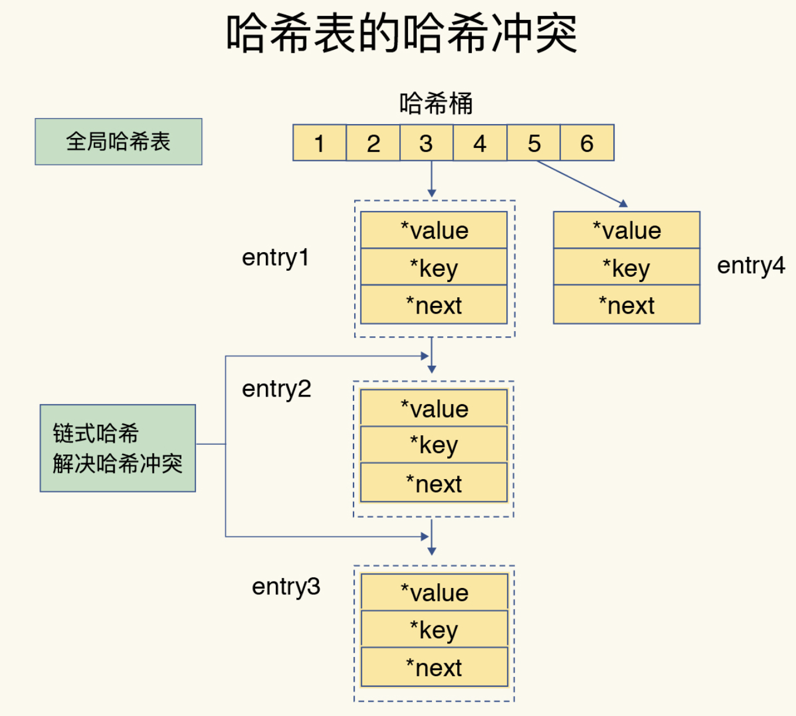

## 数据结构： 快速的redis 有哪些慢操作？

redis 收到一个键值对操作后，能以微妙级别的速度找到数据，并快速完成操作。

### redis 性能突出的原因：
1. 内存数据库，所有的操作都是在内存上完成，内存的访问速度本身你就很快
2. 数据结构 键值对是按照一定的数据结构组织的，操作键值对最终就是对数据结构进行增删改查操作，高效的数据结构是redis 快速处理数据的基础。

### redis 的数据类型和底层的数据结构

* redis 数据类型
    * String(字符串) => 简单动态字符串
    * List(列表)    => 双向链表 & 压缩列表
    * Hash(哈希)    => 哈希表 & 压缩列表
    * Set(集合) => 压缩列表 & 跳表
    * Sotted Set(有序集合) => 哈希表 & 整数数组

* 底层数据结构
    * 简单动态字符串
    * 双向链表
    * 压缩列表
    * 哈希表
    * 跳表
    * 整数数组

String 的底层实现只有一种数据结构，简单动态字符串。而 List, Hash, Set 和 Sorted Set 这四种数据类型，都有两种底层结构。通常情况下，我们会把这四种类型成为集合类型，他们的特点是一个键对应了一个集合的数据。

### 键和值用什么结构组织？

为了实现快速访问，redis 使用了一个hash 表来保存所有键值对。

一个哈希表其实就是一个数组，数组的每个元素成为哈希桶，哈希桶的元素并不是保存的值本身，而是指向具体值的指针。也就是说不管值是String,还是集合类型，哈希桶中的元素都是指向他们的指针。

如图：哈希桶中每个entry 元素都*key 和 *value 指针，分别指向实际的键和值。这样一来，即使值是一个集合，也可以通过 *vlaue 指针被找到。

哈希表保存了所有的键值对，所以把它称为全局哈希表。哈希表的最大好处是可以用O(1)的时间复杂度，快速查找到对应键值对  - 只需计算键的哈希值，就可以知道它所对应哈希桶的位置，然后访问相应的entry元素。

所以查找的过程主要依赖于哈希运算，和数据量的多少没有直接关系。不管哈希表里是10万个键还是100万个键，我们只需要一次计算就能找到对应的键。

当往redis写入大量数据后，就可能后发现操作有时候变慢了，这就是可能存在当一个潜在的风险点：**哈希表的冲突问题和ehash带来的操作阻塞**

### 为什么哈希表操作变慢了？

#### 哈希冲突

当往哈希表中写入大量数据时候，就可能会出现哈希冲突。难免会有一些键的哈希值对应到了同一个哈希桶中。

#### redis 哈希冲突解决方式

链式哈希，是指同一个哈希桶中的多个元素用一个链表来保存。他们之间一次用指针来链接。

如图所示：entry1，entry2 和 entry3都需要保存在哈希桶3中，导致了哈希冲突。此时，entry1元素会通过*next 指针指向 entry2, entry2 会通过 *next 指针指向 entry3。 这样一来，即使哈希桶3中的元素有100个，我们也可以通过entry 元素中的指针，把他们连起来。就形成了一个链表，也叫做哈希冲突链。

此时依然存在问题：随着写入数据越来阅读，哈希冲突也越来越多。哈希冲突链就会越来越长。就会导致在单个链表上的元素查找耗时长，效率降低。引入了rehash 操作解决。

### rehash 操作

rehash 操作就是增加现有的哈希桶数量，让逐渐增多的entry 元素能在更多的桶之间分散保，减少单个桶的元素数量，从而减少单个桶中的冲突。

为了使 redis rehash 操作更高效，redis 默认使用两个全局哈希表：哈希表1 和  哈希表2。一开始当你插入数据的时候，默认使用哈希表1，此时的哈希表2没有被分配空间，随着数据的逐渐增多，redis 开始 rehash,这个过程分为三步：

