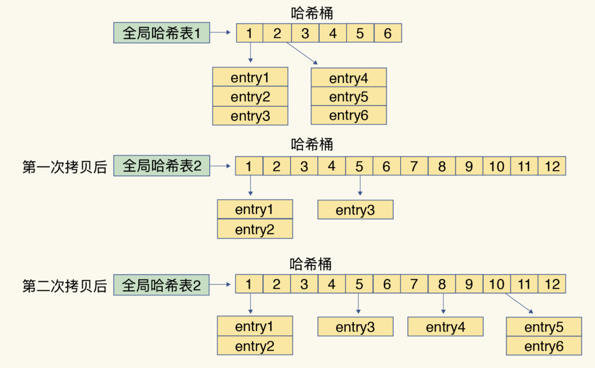
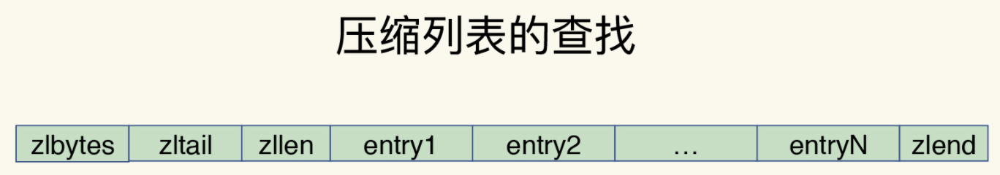
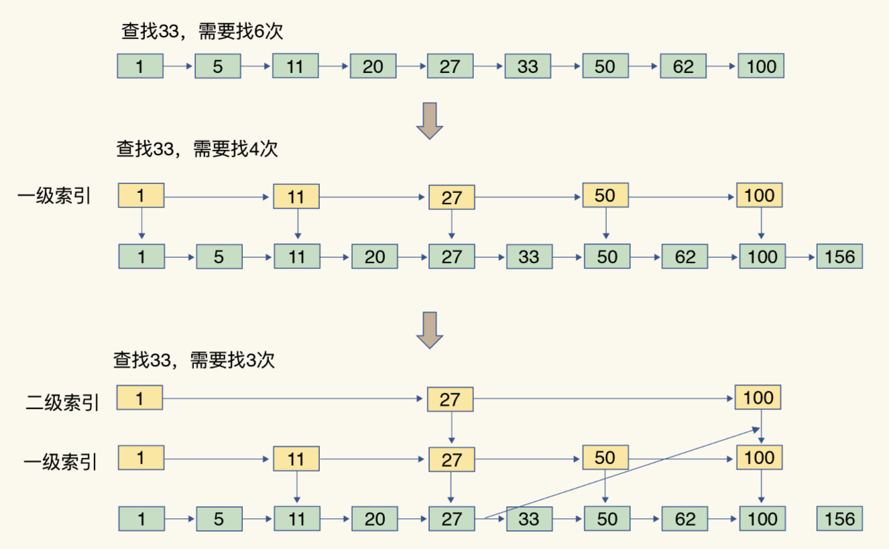
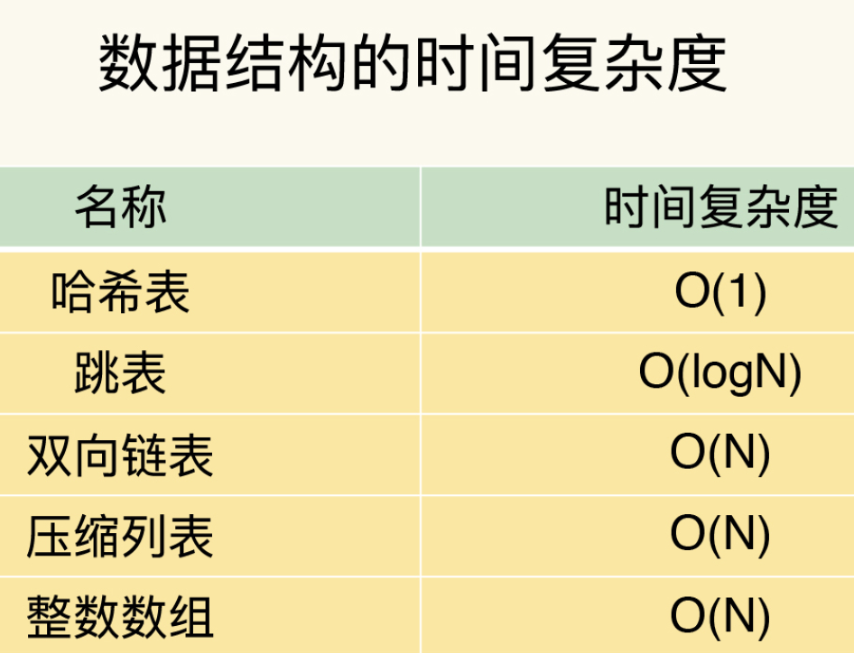

## 数据结构： 快速的redis 有哪些慢操作？

redis 收到一个键值对操作后，能以微妙级别的速度找到数据，并快速完成操作。

### redis 性能突出的原因：
1. 内存数据库，所有的操作都是在内存上完成，内存的访问速度本身你就很快
2. 数据结构 键值对是按照一定的数据结构组织的，操作键值对最终就是对数据结构进行增删改查操作，高效的数据结构是redis 快速处理数据的基础。

### redis 的数据类型和底层的数据结构

* redis 数据类型
    * String(字符串) => 简单动态字符串
    * List(列表)    => 双向链表 & 压缩列表
    * Hash(哈希)    => 哈希表 & 压缩列表
    * Set(集合) => 压缩列表 & 跳表
    * Sotted Set(有序集合) => 哈希表 & 整数数组

* 底层数据结构
    * 简单动态字符串
    * 双向链表
    * 压缩列表
    * 哈希表
    * 跳表
    * 整数数组

String 的底层实现只有一种数据结构，简单动态字符串。而 List, Hash, Set 和 Sorted Set 这四种数据类型，都有两种底层结构。通常情况下，我们会把这四种类型成为集合类型，他们的特点是一个键对应了一个集合的数据。

### 键和值用什么结构组织？

为了实现快速访问，redis 使用了一个hash 表来保存所有键值对。

一个哈希表其实就是一个数组，数组的每个元素成为哈希桶，哈希桶的元素并不是保存的值本身，而是指向具体值的指针。也就是说不管值是String,还是集合类型，哈希桶中的元素都是指向他们的指针。

如图：哈希桶中每个entry 元素都*key 和 *value 指针，分别指向实际的键和值。这样一来，即使值是一个集合，也可以通过 *vlaue 指针被找到。

哈希表保存了所有的键值对，所以把它称为全局哈希表。哈希表的最大好处是可以用O(1)的时间复杂度，快速查找到对应键值对  - 只需计算键的哈希值，就可以知道它所对应哈希桶的位置，然后访问相应的entry元素。

所以查找的过程主要依赖于哈希运算，和数据量的多少没有直接关系。不管哈希表里是10万个键还是100万个键，我们只需要一次计算就能找到对应的键。

当往redis写入大量数据后，就可能后发现操作有时候变慢了，这就是可能存在当一个潜在的风险点：**哈希表的冲突问题和ehash带来的操作阻塞**

### 为什么哈希表操作变慢了？

#### 哈希冲突

当往哈希表中写入大量数据时候，就可能会出现哈希冲突。难免会有一些键的哈希值对应到了同一个哈希桶中。

#### redis 哈希冲突解决方式

链式哈希，是指同一个哈希桶中的多个元素用一个链表来保存。他们之间一次用指针来链接。

如图所示：entry1，entry2 和 entry3都需要保存在哈希桶3中，导致了哈希冲突。此时，entry1元素会通过*next 指针指向 entry2, entry2 会通过 *next 指针指向 entry3。 这样一来，即使哈希桶3中的元素有100个，我们也可以通过entry 元素中的指针，把他们连起来。就形成了一个链表，也叫做哈希冲突链。

此时依然存在问题：随着写入数据越来阅读，哈希冲突也越来越多。哈希冲突链就会越来越长。就会导致在单个链表上的元素查找耗时长，效率降低。引入了rehash 操作解决。

### rehash 操作

rehash 操作就是增加现有的哈希桶数量，让逐渐增多的entry 元素能在更多的桶之间分散保，减少单个桶的元素数量，从而减少单个桶中的冲突。

为了使 redis rehash 操作更高效，redis 默认使用两个全局哈希表：哈希表1 和  哈希表2。一开始当你插入数据的时候，默认使用哈希表1，此时的哈希表2没有被分配空间，随着数据的逐渐增多，redis 开始 rehash,这个过程分为三步：

1. 给哈希表2分配更大的空间，例如是当前哈希表1的2倍
2. 把哈希表1中的数据重新映射并拷贝到哈希表2中（涉及大量的数据拷贝）
3. 释放哈希表1 的空间

至此，我们可以从哈希表1切换到哈希表2，用增大的哈希表2保存更多的数据，而原来的哈希表1留作下一次rehash 扩容备用。

第二步涉及大量的数据拷贝，为防止一次性把 哈希表1中的数据全部迁移完，造成redis线程阻塞，无法服务其他请求，redis 采用**渐近式 rehash**

简单来说 在第二步拷贝数据时，redis仍然正常处理客户端请求，每处理一个请求，redis从哈希表中的第一个索引位置开始，顺着将这个索引位置上的所有entries都拷贝到哈希表2中，等待处理下一个请求时，再顺带拷贝哈希表1中的下一个索引位置的entries。如图所示：

这样就巧妙的将一次性大量的拷贝开销，分摊到多次请求的过程中。避免了耗时操作，保证了数据的快速访问。

对于 String 类型来说，找到哈希桶的位置就可以直接对他 增删改查了。所以，操作表O(1) 操作复杂度也就是它的复杂度。

### 集合数据操作效率

集合类型值，第一步时通过全局哈希表找到对应的哈希桶的位置，第二步是在集合中再增删改查。

集合与底层数据结构有关，使用哈希表的集合要比使用链表实现的集合访问效率更高。其次，操作效率和操作本身的执行有关，比如 读写一个元的操作要比读写所有元素的效率更高。

### 其他底层数据结构介绍

* 整数数组和双向链表：
    * 顺序读写（通过数组下标或者链表的指针逐个元素访问，操作复杂读
    O(n) )， 操作效率低
* 压缩列表和跳表
    * 压缩列表
        * 压缩列表类似于一个数组，数组中的每一个元素都对应保存一个数据。
        * 和数组不同的是，压缩列表在表头有三个字段zlbytes,zltail,zllen, 分别表示列表长度，列表尾的偏移量和列表中entry的个数。压缩列表在表尾还有一个zlend,表示列表结束。
        
        * 在压缩列表中，如果我们要查找第一个或者最后一个元素，可以通过表头三个字段的长度直接定位，复杂度是O(1)。而查找其他元素时，效率就没那么高了，只能逐个查找，复杂度为O(n)。
    * 跳表
        * 有序链表只能逐一查找元素，操作起来比较慢，复杂度为O(n)
        * 跳表增加了多级索引，通过索引位置的几个跳转，实现了数据的快速定位，如图：
        
        * 时间复杂度为O(logN)
* 相关数据结构的时间复杂度

### 不同操作的复杂度

读写单个集合元素的：HGET，HSET

操作多个元素的： SADD

对整个元素进行遍历：SMEMBERS

口诀记录：

* 单元素操作是基础
* 范围操作非常耗时
* 统计操作通常高效
* 例外情况只有几个

