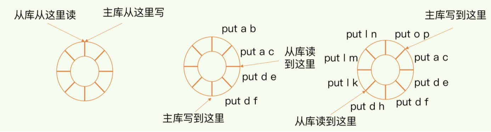
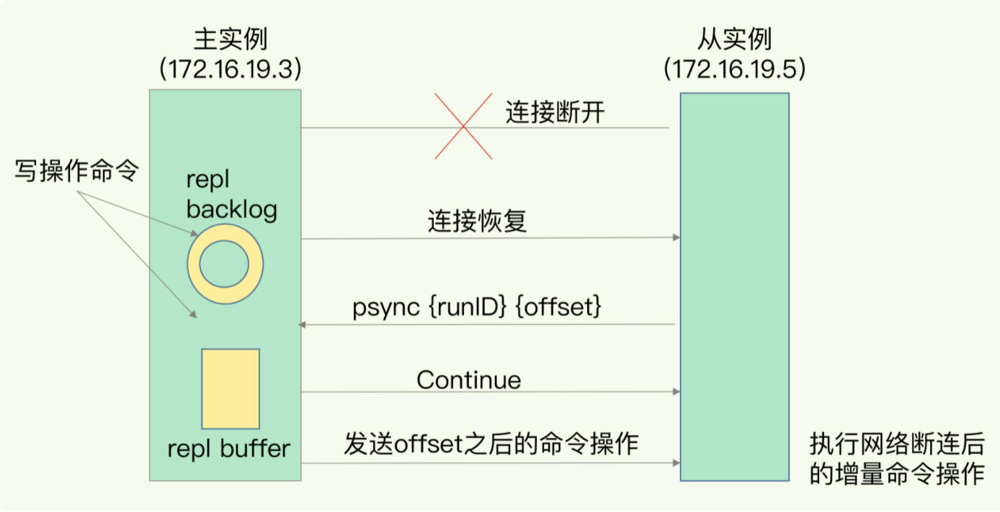

## redis数据同步

redis 有两种持久化方式，分别是RDB(快照) 和AOF(文件追加)，如果redis发生宕机，则可以通过重新读入RDB文件和回放日志的方式恢复数据，从而保证尽量的少丢数据，提高可靠性。

### redis 主从模式

redis提供了主从模式，以保证数据副本一致，主从库之间采用的是读写分离模式。

* 读操作：主库，从库都可以接收
* 写操作：到主库上执行，然后主库将数同步给从库


### 为什么采用读写分离的方式？

如上图所示，不管主库还是从库如果都可以接收客户端的写操作，而客户端对同一个数据k1前后做了三次修改，每次的修改请求发到了不同的实例上，在不同的实例上执行，那么这三个数据在三个实例上的数据就不一致了（分别是 v1,v2,v3）。在读取这个数据的时候，就有可能读取到旧数据的值。

如果我们硬要保持这三个实例上的数据一致，就要涉及都加锁、实例间协商是否完成修改等一系列操作，会带来巨大的开销。

而主从模式旦采用读写分离之后，所有数据的修改只会在主库上进行，不用协调三个实例。主库有了最新的数据后，会同步给从库，这样主从库的数据就是一致的了。

### 主从同步如何完成

当我们启动多个Redis实例的时候，它们之间就可以通过replicaof（Redis 5.0之前使用slaveof）命令形成主库和从库的关系，之后会按照三个阶段完成数据的第一次同步。

例如：现在有 现在有实例1，ip(192.16.19.3) 和实例2(192.16.19.5)，在实例2上执行以下命令后，实例2就变成了实例1的从库，并从实例1上复制数据：
```
REPLICAOF 192.16.19.3 3306
```

**三阶段数据同步**


第一阶段：主要是主从库间建立连接，协商同步的过程，主要是为全量复制做准备。在这一步，从库和主库建立起连接，并告诉主库即将进行同步，主库确认回复后，主从库间就开始同步了。

从库会给主库发送一个psync命令，表示要进行数据同步，主库根据这个命令参数来启动复制。psync包含两个参数，一个主库的runID和复制进度offset两个参数。

* runID: 每次redis实例启动都会自动生成一个随机ID，用来唯一标记这个实例。当从库和主库第一次复制时，因为不知道主库当runID，所以将runID设置为"?"
* offset 此时设置为1；表示第一次复制。

主库收到psync命令后，会用FULLRESYN命令带上两个参数：主库runID和目前的复制进度offset，返回给从库。从库收到相应后，会记录两个参数。

FULLRESYNC响应表示第一次会全量复制，也就是说主库会把当前所有的数据都复制给从库。

第二阶段：主库将所有的数据同步给从库。从库收到数据后，在本地完成数据的加载。这个过程依赖于内存快照生成的RDB文件。

具体来说，主库执行bgsave命令，生成RDB文件，接着将文件发送给从库。从库接收到RDB文件后，会清空当前数据库，然后加载RDB文件。这是因为从库在通过replicaof开始和主库同步前，可能保存了其他到数据。为了避免之前数据
的影响，从库需要先把当前数据库清空。

在主库将数据同步给从库的过程中，主库不会被阻塞仍然可以接收请求。否则，redis的服务就中断了。但是这些请求的写操作并没有写到刚才生成的RDB文件中。为了保证主从库的数据一致性，主库会在内存中用专门replication buffer,记录RDB文件生成后收到的所有写操作。

最后也就是第三阶段，主库会把第二阶段执行过程中新收到的写命令，再发送给从库。具体的操作是，当主库完成RDB文件发送后，就会把replication buffer中的修改操作发送给从库，从库在重新执行下这些操作。这样一来，主从库就实现同步了。

### 主从级联模式

主从级联模式的主要好处是分担全量复制时主库的压力

架构模式为："主 - 从 - 从"

通过"主 - 从 - 从"模式将主库生成RDB和传输RDB的压力，以级联的方式分散到从库上。

当我们部署主从集群的时候，可以手动选择一个从库（比如选择内存资源配置较好的从库），用于级联其他从库。

在我们部署主从集群的时候，可以手动选择一个从库（比如内存资源配置较高的从库），用于级联其他从库。然后可以再选择一些从库（例如三分之一的从库），在这些从库上执行一下命令，让它和刚才所选的从库建立其主从关系。
```
replicaof 所选从库ip 6379
```

这样 这些从库在同步时就不在和主库进行交互了，只要和级联的从库进行写操作同步就好了，从而减轻主库的压力。


一旦主从库完成全量复制，他们之间就会一直维护一个网络连接，主库会通过这个连接将后续陆续收到的命令，在同步给从库，这个过程也成为基于长连接的命令传播，可以避免重复建立连接的开销。

但是网络断连或者阻塞，主从库之间就无法基于命令传播了，从库的数据自然也就没法和主库数据保持一致了，客户端就有可能从数据库中读到旧数据。

### 主从间网络断了怎么办？

在redis2.8之前，如果主从库在命令传播时出现了网络闪断，那么从库就会和主库进行一个全量的复制，性能开销会非常大。

从redis2.8开始，网络断了之后，主从库会采用增量复制的方式继续同步。只把主从库网络断连期间收到的命令同步给从库。

增量复制时， 主从库会通过repl_backlog_buffer这个缓冲去用于增量命令的同步。

当主从库断连后，主库会把断连期间收到的写命令，写入 replication buffer,同时页会把这些操作写入到repl_backlog_buffer这个缓冲区。

repl_backlog_buffer是一个环形缓冲区，主库会记录自己写的位置，从库页会记录自已经读的位置。

刚开始主库和从库写读位置在一起，这是它们的开始位置。随着主库不断接收新的写操作，他在缓冲去写的位置会逐步偏离起始位置，我们通常用偏移量来衡量这个偏移距离的大小。对于主库来说这个偏移量就是master_repl_offset。主库接收到的写操作阅读，这个偏移量就会越大。

同样从库在完成写操作后，他在缓冲区的读位置也开始逐步偏移刚才的起始位置，此时，从库已复制的偏移量slave_repl_offset也在不断增加。正常情况下，这两个偏移量基本相等。



主从库的连接恢复之后，从库首先会给主库发送一个psync命令，并把当前的slave_repl_offset发给主库，主库会判断自己的master_repl_offset和slave_repl_offset之间的差距。

在主库断连阶段，主库可能会收到新的写操作命令，所以，一般来说，master_repl_offset会大于slave_repl_offset。此时，主库只用把master_repl_offset和slave_repl_offset之间的命令操作同步给从库就行。

如图，看下增量复制流程



repl_backlog_buffer是一个环形缓冲区，所以在缓冲区写满之后，主库会继续写入，此时就会覆盖之前写入的操作。如果从库的读取速度比较满，就有可能出现从库还未读取的操作被主库新写的操作覆盖了，这会导致主从库间的数据不一致。

如何避免这种情况呢？我们需要调整 repl_backlog_size 这个参数。这个参数和所需的缓冲区空间大小有关。缓冲区的计算公式为：缓冲空间大小 = 主库写入命令速度 * 操作大小 - 主从间网络传输速度 * 操作大小。在实际应用中，考虑到可能存在一些突发的请求压力，我们通常需要把这个缓冲空间扩大一倍，即 repl_backlog_size = 缓冲去大小 * 2，这就是repl_backlog_size的最终值。

举例：如果主库每秒2000个操作，每个操作的大小是2kB,网络每秒能传输1000个操作，那么有1000个操作需要被缓冲起来，这就至少需要2MB的缓冲空间。否则新写的命令就会覆盖旧操作了。为了应对可能突发的压力，我们最终把repl_backlog_size设置为4MB。

这样一来，增量复制时主从库的数据不一致的风险就降低了。不过，如果并发量很大，主从库的数据仍可能会不一致。

针对这种情况，一方面，可以根据redis所在服务器的内存资源再适当增加repl_backlog_size值，比如说设置成缓冲空间的4倍，另一方面，可以考虑到分片集群来分担单个主库的请求压力。