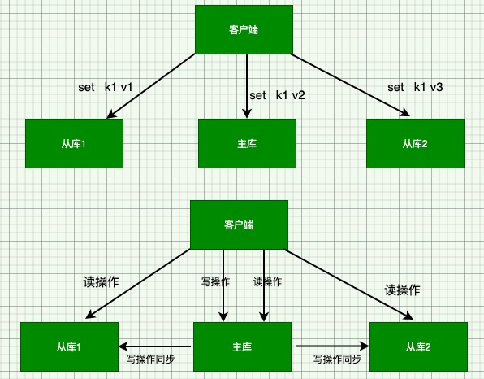
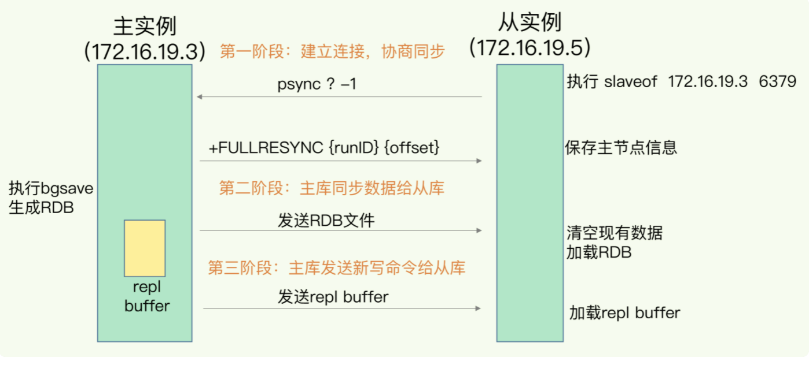
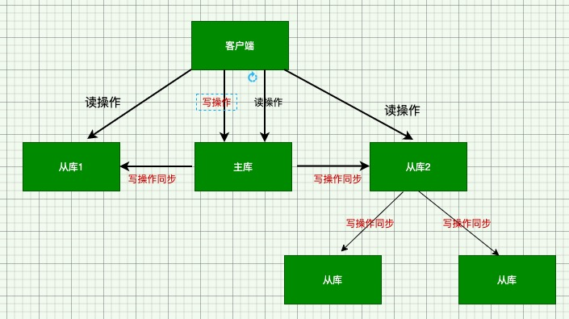

## redis数据同步

redis 有两种持久化方式，分别是RDB(快照) 和AOF(文件追加)，如果redis发生宕机，则可以通过重新读入RDB文件和回放日志的方式恢复数据，从而保证尽量的少丢数据，提高可靠性。

### redis 主从模式

redis提供了主从模式，以保证数据副本一致，主从库之间采用的是读写分离模式。

* 读操作：主库，从库都可以接收
* 写操作：到主库上执行，然后主库将数同步给从库



### 为什么采用读写分离的方式？

如上图所示，不管主库还是从库如果都可以接收客户端的写操作，而客户端对同一个数据k1前后做了三次修改，每次的修改请求发到了不同的实例上，在不同的实例上执行，那么这三个数据在三个实例上的数据就不一致了（分别是 v1,v2,v3）。在读取这个数据的时候，就有可能读取到旧数据的值。

如果我们硬要保持这三个实例上的数据一致，就要涉及都加锁、实例间协商是否完成修改等一系列操作，会带来巨大的开销。

而主从模式旦采用读写分离之后，所有数据的修改只会在主库上进行，不用协调三个实例。主库有了最新的数据后，会同步给从库，这样主从库的数据就是一致的了。

### 主从同步如何完成

当我们启动多个Redis实例的时候，它们之间就可以通过replicaof（Redis 5.0之前使用slaveof）命令形成主库和从库的关系，之后会按照三个阶段完成数据的第一次同步。

例如：现在有 现在有实例1，ip(192.16.19.3) 和实例2(192.16.19.5)，在实例2上执行以下命令后，实例2就变成了实例1的从库，并从实例1上复制数据：
```
REPLICAOF 192.16.19.3 3306
```

**三阶段数据同步**



第一阶段：主要是主从库间建立连接，协商同步的过程，主要是为全量复制做准备。在这一步，从库和主库建立起连接，并告诉主库即将进行同步，主库确认回复后，主从库间就开始同步了。

从库会给主库发送一个psync命令，表示要进行数据同步，主库根据这个命令参数来启动复制。psync包含两个参数，一个主库的runID和复制进度offset两个参数。

* runID: 每次redis实例启动都会自动生成一个随机ID，用来唯一标记这个实例。当从库和主库第一次复制时，因为不知道主库当runID，所以将runID设置为"?"
* offset 此时设置为1；表示第一次复制。

主库收到psync命令后，会用FULLRESYN命令带上两个参数：主库runID和目前的复制进度offset，返回给从库。从库收到相应后，会记录两个参数。

FULLRESYNC响应表示第一次会全量复制，也就是说主库会把当前所有的数据都复制给从库。

第二阶段：主库将所有的数据同步给从库。从库收到数据后，在本地完成数据的加载。这个过程依赖于内存快照生成的RDB文件。

具体来说，主库执行bgsave命令，生成RDB文件，接着将文件发送给从库。从库接收到RDB文件后，会清空当前数据库，然后加载RDB文件。这是因为从库在通过replicaof开始和主库同步前，可能保存了其他到数据。为了避免之前数据
的影响，从库需要先把当前数据库清空。

在主库将数据同步给从库的过程中，主库不会被阻塞仍然可以接收请求。否则，redis的服务就中断了。但是这些请求的写操作并没有写到刚才生成的RDB文件中。为了保证主从库的数据一致性，主库会在内存中用专门replication buffer,记录RDB文件生成后收到的所有写操作。

最后也就是第三阶段，主库会把第二阶段执行过程中新收到的写命令，再发送给从库。具体的操作是，当主库完成RDB文件发送后，就会把replication buffer中的修改操作发送给从库，从库在重新执行下这些操作。这样一来，主从库就实现同步了。

### 主从级联模式

主从级联模式的主要好处是分担全量复制时主库的压力

架构模式为："主 - 从 - 从"

通过"主 - 从 - 从"模式将主库生成RDB和传输RDB的压力，以级联的方式分散到从库上。

当我们部署主从集群的时候，可以手动选择一个从库（比如选择内存资源配置较好的从库），用于级联其他从库。

在我们部署主从集群的时候，可以手动选择一个从库（比如内存资源配置较高的从库），用于级联其他从库。然后可以再选择一些从库（例如三分之一的从库），在这些从库上执行一下命令，让它和刚才所选的从库建立其主从关系。
```
replicaof 所选从库ip 6379
```

这样 这些从库在同步时就不在和主库进行交互了，只要和级联的从库进行写操作同步就好了，从而减轻主库的压力。



一旦主从库完成全量复制，他们之间就会一直维护一个网络连接，主库会通过这个连接将后续陆续收到的命令，在同步给从库，这个过程也成为基于长连接的命令传播，可以避免重复建立连接的开销。

但是网络断连或者阻塞，主从库之间就无法基于命令传播了，从库的数据自然也就没法和主库数据保持一致了，客户端就有可能从数据库中读到旧数据。

### 主从间网络断了怎么办？

