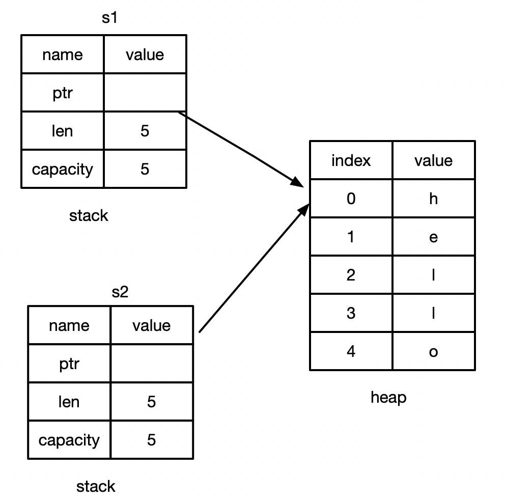
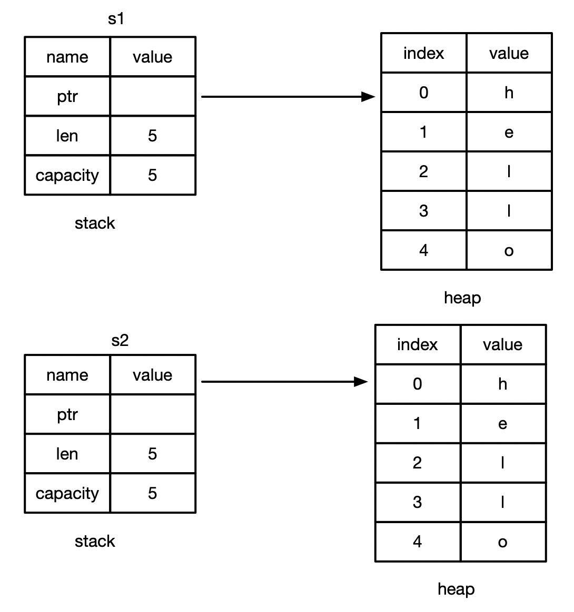

## 所有权规则

* 每个值都有一个变量，这个变量是该值的所有者
* 每个值同时只能有一个所有者。
* 当所有者超出作用域（scope)时，该值将被删除。

## 变量作用域

* Scope 就是程序中一个项目的有效范围
如：
```
fn main() {
    // s 不可用
    let s = "hello"; // s 可用
    // 可以对s进行操作
}// s 作用域到此结束，s 不再可用
```

### String 类型
* string 比那些基础数据类型更复杂
* 字符串字面值：程序里手写的那些字符串值。他们是不可变的
* Rust 还有第三种数据类型：String
    * 在heap 上分配。能够存储在编译时未知数量的文本

### 创建String 类型的值
* 可以使用from 函数从字符串字面值创建出String 类型。
* let s = String::from("hello");
    * "::" 表示from 是String 类型下的函数
* 这类字符串是可以被修改的
如：
```
fn main() {
    let mut s  = String::from("hello");
    s.push_str(", world");
    println!("{}", s);
}
```
* 为什么String类型的字面值可以修改，而字符串字面值却不能修改？
    * 因为他们处理内存的方式不通

### 内存和分配

* 字符串字面值，在编译时就知道它的内容了，其文本内容直接被硬编码到最终到可执行文件里。
    * 速度快、高效。是因为其不可变性
* String 类型，为了支持可变性，需要在heap 上分配内存来保存编译时未知的文本内容。
    * 操作系统必须在运行时来请求内存。
        * 这步调用Strig::from 来实现。
    * 当用完String 之后，需要使用某种方式将内存返回给操作系统
        * 这步，在拥有GC的语言中，GC 会跟踪并清理不再使用的内存。
        * 没有GC，就需要我们取识别内存何时不再使用，并调用代码将它返回。
            * 如果忘了，内存就会浪费
            * 如果提前做了，变量就会非法。
            *如果做了两次，也就是Bug，必须一次分配对应一次释放。

### Rust 内存方案
* Rust 采用了不同的方式：对于某个值来说，当拥有它的变量走出作用范围时，内存会立即自动的交还给操作系统
* drop 函数

### 变量和数据交互的方式：移动（Move）
* 多个变量可以与同一个数据使用一种特殊的方式来交互。
* 
```
let x =  5;
let y = x;
```
* 整数是已知且固定大小的简单的值，这两个5被压到了stack 中。

### String 的移动（Move）
```
let s1 = String::from("hello");
```
**hello的存放过程**

* 一个String 由三部分组成：
    * 一个指向存放字符串内容的内容的内存指针
    * 一个长度
    *  一个容量
* 上面这些东西存放在stack 上
* 存放字符串内容的部分在heap 上
* 长度为len，就是存放字符串内容所需字节数。
* 容量 capacity 是指String从操作系统总共获得内存的总字节数。

### 复制过程
```
let s1 = String::from("hello");
let s2 = s1;
```


* 当把 s1 复制个s2,String的数据被复制了一份，如上图：
    * 在stack 上复制了一份指针、长度、容量
    * 并没有复制指针所指向的heap 上的数据
* 当变量离开作用域时，Rust 会自动调用drop函数，并将变量使用的heap内存释放。
* 当s1和s2 离开作用域时，它们都会尝试释放相同的内存：
    * 二次释放（double free）bug
* 为了保证内存安全：
    * Rust 没有尝试复制被分配的内存
    * Rust 让s1失效
        * 当s1 离开作用域之后，Rust不需要释放任何东西
* 试试看当 s2  创建以后，再使用s1 是什么效果，如：

```
fn main() {
    let s1 = String::from("hello");
    let s2 = s1;
    println!("{}",  s1);
}
// 此时s1会报：
// value borrowed here after move
```

### 拷贝和移动
* 浅拷贝（shallow copy）
* 深拷贝(deep copy)
* 你也许会将复制指针、长度、容量视为浅拷贝，但由于Rust让s1失效了，所以我们用了一个新的术语：移动（Move）
* 隐含了一个新的设计原则：Rust 不会自动创建数据的深拷贝
    * 运行时性能而言，任何自动赋值的操作都是廉价的

### 克隆（Clone）
* 如果真想heap 上面的String数据进行深度拷贝你，而不是仅仅是stack 上的数据，可以使用clone方法，如：
```
fn main() {
    let s1 = String::from("hello");
    let s2 = s1.clone();
    println!("s1= {}, s2= {}",  s1, s2);
}
```
**其过程如下：**


**克隆操作消耗资源，主要针对heap 上，也就是堆上的数据**

### Stack 上的数据：复制
```
fn main() {
    let x = 5;
    let y = s1;
    println!("s1= {}, s2= {}",  s1, s2);
}
```

x 是整数类型，整数类型在编译时就确定了自己的大小，并且能够将自己的数据完整的存储在stack中，对这些值的复制操作永远都是非常快速的，在创建y之后没有任何理由去阻止变量x继续保持有效，换句话说对这些类型而言，深度拷贝和浅拷贝是没有任何区别的，调用clone 方法并不会与直接的浅拷贝有任何行为上的区别，因此我们不需要在类似的问题中考虑上面的问题。

* Copy trait, 可以用于像整数这样完全存放在stack 上面的类型。
* 如果一个类型实现了Copy 这个trait，那么旧的变量在复制后仍然可用。
* 如果一个类型或者该类型的一部分实现了Drop trait，那么Rust 不允许让他再去实现Copy trait了，否则编译时会报错。

### 一些拥有Copy trait 的类型
* 任何简单标量的组合类型都可以是Copy的
* 而任何需要分配内存或某种资源的都不是Copy的
* 一些拥有Copy trait 的类型：
    * 所有的整数类型，如:u32
    * bool
    * char
    * 所有的浮点类型，例如 f64
    * Tuple(元组)，如果其所有字段都是Copy的， 那么这个Tuple 也是拥有Copy trait类型的
        * (i32, i32) 是
        * (i32, String) 不是
