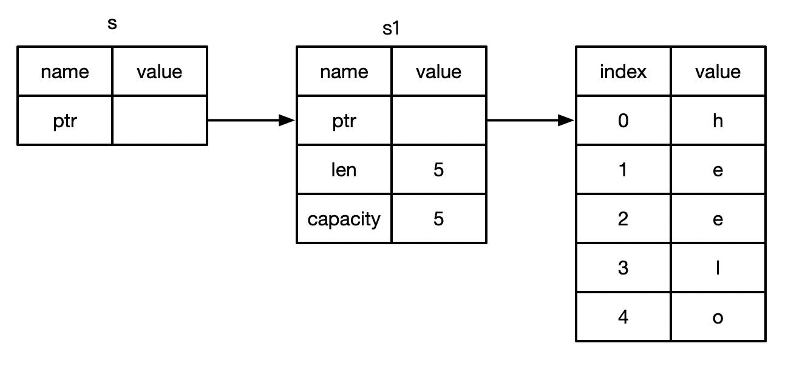

## 引用与借用

> https://www.bilibili.com/video/BV1hp4y1k7SV?p=18

如：
```
fn main() {
    let s1 = String::from("hello");

    // 将 s1 指针传递过去
    // &s1 创建引用，引用s1,但并不拥有s1
    // 因为 &s1 并不用拥有s1，所以当&s1 走出作用域时，所指向的s1 并不会被销毁
    let len = calculate_length(&s1);
    println!("{}", len)
}

// 此处 s 为你String引用类型，并未获得其所有权，函数执行完毕 也不会销毁
fn calculate_length(s: &String) -> usize {
    s.len()
}
```

* 参数类型是 &String 而不是 String
* & 符号就表示引用: 允许你引用某些值而不取得其所有权

* 解引用 * (后面课程讲)

### 借用
* 把引用作为函数参数的这个行为叫做借用
* 对于引用类型，不能修改其值，如：
```
fn main() {
    let s1 = String::from("hello");

    // 将 s1 指针传递过去
    let len = calculate_length(&s1);
    println!("{}", len)
}
// 此处 s 为你String引用类型
fn calculate_length(s: &String) -> usize {
    s.push_str(",hello");
    s.len()
}
// 此时 运行时会报：
// cannot borrow `*s` as mutable, as it is behind a `&` referenc
```
* 和变量一样，引用默认也是不可变的

### 可变引用
如：
```
fn main() {
    let mut  s1 = String::from("hello");

    // 指定引用也是可变的
    let len = calculate_length(&mut s1);
    println!("{}, s = {}", len, s1)
}
// 参数 s 可变类似的String
fn calculate_length(s: &mut String) -> usize {
    s.push_str(",hello");
    s.len()
}
```

* 可变引用有一个重要的限制：在特定作用域内，对某一块儿数据，只能有一个可变的引用。
    - 这样做的好处是可在编译时防止数据竞争

如：
```
fn main(){
    let mut s = String::from("hello");
    let s1 = &mut s;
    let s2 = &mut s;
    println!("s1 = {}, s2  = {}", s1, s2);
}

// error : cannot borrow `s` as mutable more than once at a time
```

* 一下三种行为下会发生数据竞争
    * 两个或多个指针同时访问同一个数据
    * 至少有一个指针用于写入数据
    * 没有使用任何机制来同步对数据的访问。
* 可以通过创建新的作用域，来允许非同时的创建多个可变引用，如：
```
fn main() {
    let mut s = String::from("hello");
    {
        let s1 = &mut s;
        println!("{}", s1)
    }
    let s2 = &mut s;
    println!("{}", s2)
}
```

### 另一个限制
* 不可以同时拥有一个可变引用和一个不可变引用。
* 多个不变的引用是可以的
```
fn refer1() {
    let mut s = String::from("hello");
    let r1 = &s;
    let r2 = &s;
    let r3 = &mut s;
    println!("{}, {}, {}", r1, r2, r3)
}
// error : cannot borrow `s` as mutable because it is also borrowed as immutable
```

### 悬空引用 Dangling References
* 悬空指针（Dangling Pointer）: 一个指针引用了内存中的某个地址，而这块内存可能已经释放并分配给其它人使用了。
* 在Rust里，编译器可保证引用永远都不是悬空的：
    * 如果你引用了某些数据，编译器将保证在引用离开作用域之前数据不会离开作用域
如：
```
fn main(){
    let t = dangle();
}
// dangle 执行完毕 s内存空间将被释放  &s 变为悬空指针
fn dangle() -> &String {
    let s = String::from("hello");
    &s
}
// error: error[E0106]: missing lifetime specifier
```

### 引用的规则
* 在任何给定的时刻，只能满足下列条件之一：
    * 一个可变的引用
    * 任意数量不可变的引用
* 引用必须一直有效