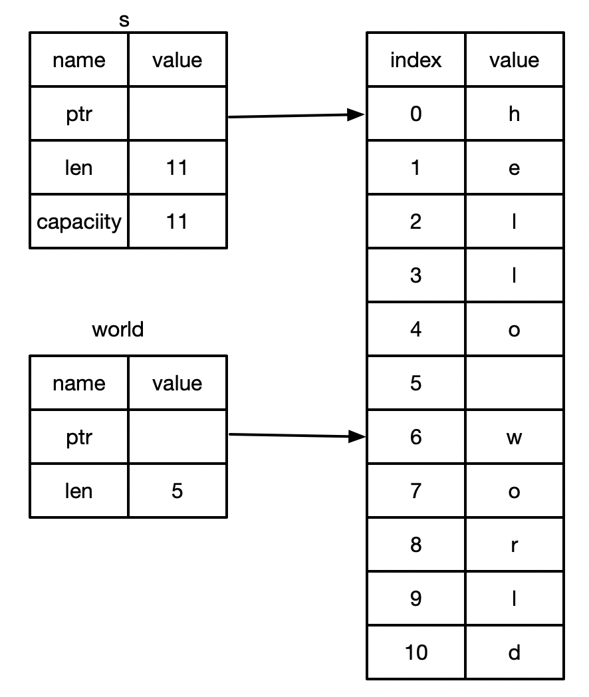

## 切片

Rust 的另外一种不持有所有权的数据类型：切片（slice）

* 尝试编写一个函数：
    * 它接收一个字符串作为参数
    * 返回它在字符串里找到的第一个单词
    * 如果函数没找到任何空格，那么整个字符串就被返回

如：
```
fn main() {
    println!("Hello, world!");
    let s = String::from("hello world");
    let index = first_world(&s);
    println!("{}, {}", index, s)
}

fn first_world(s: &String) -> usize {
    let bytes =  s.as_bytes();
    for (i,&byte) in bytes.iter().enumerate() {
        if byte == b' ' {
            return i
        }
    }
    return s.len()
}
```     

**注意**
index 往往需要以来字符串s存在，当字符串s 被销毁时，index 往往也 变得无意义，无法提取 字符串的字符，此时需要特别注意 s的作用域，相当繁琐，所以 slice 切片就诞生了。

### 字符串切片
* 字符串切片是指向字符串中一部分内容的引用
如：
```
fn main() {
    let s = String::from("hello world");
    let hello =  &s[0..5];
    let world = &s[6..11];
    println!("1 = {}, 2 = {}", hello, world)
}
```
* 形式： \[开始索引..结束索引\]
    * 开始索引就是切片起始未知的索引值
    * 结束索引是切片终止位置的下一个索引值



slice 相关语法糖：
```
let s = String::from("hello world");
let hello =  &s[0..5];
// 等同于
let hello =  &s[..5];

let world = &s[6..11];
// 等同于
let world = &s[6..];
```

```
fn main() {
    let s = String::from("hello world");
    let hello =  &s[0..5];
    let world = &s[6..11];
    let whole = &s[..];
    println!("1 = {}, 2 = {}, whole = {}", hello, world, whole)
}
```

**注意**
* 字符串切片的范围索引必须发生在有效的utf-8字符边界内。
* 如果尝试从一个多子节的字符中创建字符串切片，程序会报错并退出。

### 使用字符串来重写例子
如：
```
fn main() {
    println!("Hello, world!");
    let mut s = String::from("hello world");
    let index = first_world(&s); // 不可变

    // 将s 清除掉，可变 ，如果调 s.clear();就会报错，一个变量同时为可变和不可变的
    // s.clear();
    println!("index = {}, {}", index, s);
}

fn first_world(s: &String) -> &str {
    let bytes =  s.as_bytes();
    for (i,&byte) in bytes.iter().enumerate() {
        if byte == b' ' {
            return &s[..i]
        }
    }
    &s[..]
}
```

### 字符串字面值是切片
* 字符串字面值被直接存储在二进制中。
```
fn main() {
    // s 为 &str 就是切片 
    // s 为指向二进制程序特定位置的切片
    // &str 为不可变的引用
    let s = "hello";
}
```
* 变量s的类型是 &str,它是指向二进制程序特定位置的切片
    * &str 是不可变的引用，所以字符串字面值也是不可变的。

### 将字符串切片作为参数传递
* fn first_world(s: &String) -> &str{}
* 通常会采用将 &str 作为参数类型，这样就可以同时接收String 和 &str 类型的参数了。
* fn first_world(s: &str) ->str {}
    * 使用字符串切片，直接调用该函数
    * 使用String,可以创建一个完整的String切片来调用该函数
* 定义函数时使用字符串切片来代替字符串引用会使我们的API更加通用，且不会损失任何功能。
如：
```
fn main() {
    let my_string= String::from("hello");
    let windex = first_world(&my_string[..]);

    let my_str = "hello";
    let wi = first_world(my_str);
}

fn first_world(s: &str) -> &str {
    let bytes =  s.as_bytes();
    for (i,&byte) in bytes.iter().enumerate() {
        if byte == b' ' {
            return &s[..i]
        }
    }
    &s[..]
}
```

### 其他类型的切片：
如：
```
fn main() {
    let  a = [1,2,3,4,5];
    let sc = &a[1..3];
    println!("{}", sc[0]);
}
```